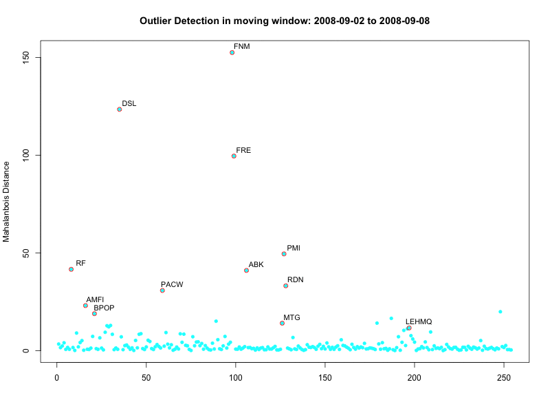

<style>
  body {font-size: 13pt; line-height:2.0;}
  pre code {font-size: 12pt;}
  .emred {color: red;}
  .emblue {color: blue;}
  .emgreen {color: green;}
</style>


```{r setup, include=FALSE}
options(width=120)
knitr::opts_chunk$set(echo = TRUE, message=FALSE, message=FALSE)
```

# Black September 2008

Here we consider a real case study of Black September in Wall Street, happend in 2008. That is a very memorable time in financial market where the collapse of several American big companies (e.g., Fannie Mae, Freddie Mac, Lehman Brothers, AIG, Merrill Lynch) in a week period led to the very large government bail out of the US financial system. We collected the stork returns of 254 financial companies from DJUSFN and KBW indices, including investment banks, large commercial banks, regional banks, insurances, and real estates.


```{r fig.width=9}
DataX = read.csv("BlackSep2008.csv")
DataX$Date = as.Date(DataX$Date, format = "%m/%d/%Y")
# SepIdx = which(DataX$Date >= '2008-09-01')
DataX = subset(DataX, Date >= '2008-09-01')
par(mar=c(3,3,3,3))
matplot(DataX$Date, DataX[,-c(1,2)], type="l", lty=1, col='gray',
        xaxt="n", ylab = "Financial Stock Returns", main="Black September in Wall Street, 2008")
axis(1, at=DataX$Date, labels=format(DataX$Date, "%m%d"))
matlines(DataX$Date, DataX[, 'Market'], type="l", lty=1, lwd=2)
TickSelect = c('WM', 'WB', 'AIG','FNM', 'FRE', 'LEHMQ')
for (i in 1:length(TickSelect)){
  tmp = which.max(abs(DataX[,TickSelect[i]]))
  text(DataX$Date[tmp], DataX[tmp, TickSelect[i]], TickSelect[i], cex=0.8)
}
```

Using `dygraph` package for interactive display: 
```{r fig.width=9}
library(xts)
DataXts = xts(DataX[,-1], order.by=DataX[,1])  # convert to time-series object
tmp = apply(DataXts[,-1], 2, sd) 
idx = which(tmp>quantile(tmp, 0.9))  # Select top 10% volatily stocks
TmpXts = DataXts[, names(idx)]

library(dygraphs)
dygraph(TmpXts, main = "Black September in Wall Street, 2008") %>% 
  dyRangeSelector() %>% 
  dyHighlight(highlightSeriesOpts = list(strokeWidth = 3)) %>% 
  dyLegend(show = "always", width=700, hideOnMouseOut = FALSE) %>% 
  dyAxis("x", drawGrid = FALSE) %>%
  dyAxis("y", valueRange = c(-3, 2.5), label = "Financial Stock Returns")
```


# Outlier Peeling Algorithm
We may use an outlier peeling algorithm based on Mahalanbois distance, as developed by [Zhang and Sudjianto (2008)](./PeelingAlgo.pdf). The R source codes are updated in R and given below.
```{r}
MdLOO = function(X) {
  tmp = lapply(as.list(seq(1,nrow(X))), function(i) {
    Mu = colMeans(X[-i, ])
    S = cov(X[-i, ])
    d = mahalanobis(X[i,], Mu, S)
    })
  unlist(tmp)
  }
MdPeel = function(X, scale=5) {
  TmpX = X
  row.names(TmpX) = seq(1,nrow(TmpX))
  OutIdx = NULL
  tmp = MdLOO(TmpX)
  while (max(tmp) > scale*IQR(tmp)) {
    idx = as.numeric(row.names(TmpX)[which.max(tmp)])
    OutIdx = c(OutIdx, idx)
    TmpX = TmpX[-which.max(tmp),]
    tmp = MdLOO(TmpX)
  }
  OutIdx
}
```

By using the peeling algorithm, and setting the moving window size to be 5, we may generate an animated plot of detected outliers over time. 
```{r}
library(animation)
a = saveGIF({
  ani.options(interval = 1)
  mw = 5
  for (i in seq(1, nrow(DataXts)-mw+1)){
    TmpX = t(DataXts[seq(i, i+mw-1),-1])
    OutIdx = MdPeel(TmpX, scale=12)
  
    Mu = colMeans(TmpX)
    S = cov(TmpX)
    d = mahalanobis(TmpX, Mu, S)
  
    plot(d, pch=19, cex=0.8, col=5, 
         main=paste("Outlier Detection in moving window:", DataX[i,1], 'to', DataX[i+mw-1,1]),
         xlab="", ylab="Mahalanbois Distance")
    points(OutIdx, d[OutIdx], col=2, cex=1.1)
    xylim=par('usr')
    text(OutIdx+0.02*diff(xylim[1:2]), d[OutIdx]+0.02*diff(xylim[3:4]), 
         row.names(TmpX)[OutIdx], cex=0.9)
  }
}, movie.name = "MdPeeling.gif", ani.width = 800, ani.height = 600)
```

```{r echo=FALSE}

``` 


# PCA and Radial Chart Visualization
The PCA (Principal Component Analysis) is an effective way of dimension reduction for multivariate data. The leading principal components may often explain the most part of variations in variables. We may use the first two components PC1 and PC2 for visualization purpose.  The radial chart is used to display the stock return positions with respect to the PC1 and PC2. 

```{r}
library(plotrix)
a = saveGIF({
  ani.options(interval = 1)
  mw = 5
  for (i in seq(1, nrow(DataXts)-mw+1)){
    TmpX = t(DataXts[seq(i, i+mw-1),-1])
    OutIdx = MdPeel(TmpX, scale=12)
    d = MdLOO(TmpX)
    tmp = princomp(TmpX)

    par(mfrow=c(1,2))
    plot(tmp, main= paste("PCA for", DataX[i,1], 'to', DataX[i+mw-1,1]))
    w = tmp$scores[,1:2]
    theta = atan2(w[,2],  w[,1])
    tmpcol=rep(5, length(d))
    tmpcol[OutIdx] = 2
    radial.plot(d, theta, rp.type='s',  radial.labels = NA, 
                point.symbols=19,  point.col=tmpcol,
                main="Radial Chart Tracking of Financial Storm")
    text(cos(theta[OutIdx])*d[OutIdx],sin(theta[OutIdx])*d[OutIdx],
         row.names(TmpX)[OutIdx], cex=0.9, adj=c(0.2,0.2))
    text(par('usr')[2], 0.05*diff(par('usr')[3:4]), "PC1", col=4)
    text(0.05*diff(par('usr')[1:2]), par('usr')[4], "PC2", col=4)
  }
}, movie.name = "RadialPeeling.gif", ani.width = 800, ani.height = 600)
```

```{r echo=FALSE}

``` 


