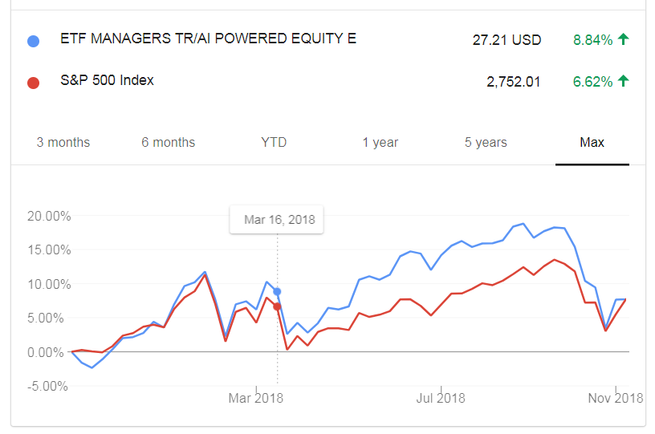
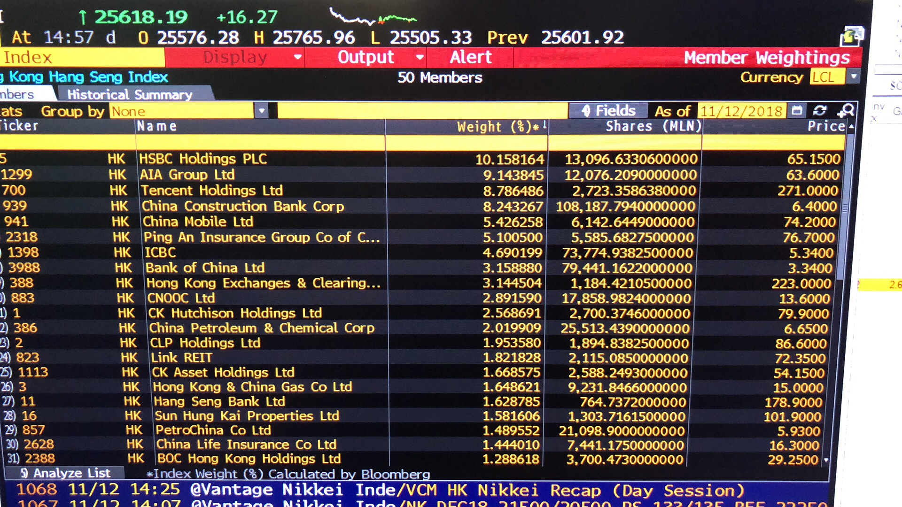

```{r setup, include=FALSE}
options(htmltools.dir.version = FALSE)
options(width=90)
knitr::opts_chunk$set(cache = FALSE, message=FALSE, warning=FALSE)
```


  
# What's covered in this lecture?


- Applied AI in Banking and Finance
  
- Case 1: Financial Index Analysis
  
  - Review of AIEQ Case
  
  - Hang Seng Index

- Case 2: Financial Anomoly Detection 

  - Outlier Peeling Algorithm
  
  - Radial Chart Visualization
---
class: center, middle

# Applied AI in Banking and Finance


---
# Applied AI in FinTech and Financial Services

There are multiple Financial Technology (FinTech) and Financial Service areas where Artificial Intelligence (AI) and Machine Learning (ML) can be applied, including

- Credit risk management (Credit scoring, Loan acquisition, Default forecasting, P2P lending)

- Investment analysis (Trading strategy, Portfolio optimization, Money management)

- Cryptocurrency (BitCoin, Crypto index)

- Fraud detection and anti-money laundering

- Customer service (Automated customer support via chatbots, Customer segmentatoin)


---
# Two FinTech Case Studies 

In this lecture, we discuss two FinTech case studies with the equipped DataViz skills:

- Case 1: Financial Index Analysis
  
  - Review of AIEQ Case 
  
  - Hang Seng Index

- Case 2: Finanial Anomoly Detection 

  - Outlier Peeling Algorithm
  
  - Radial Chart Visualization


---
class: center, middle

# Case 1: Financial Index Analysis

---
# Investment Stratgies

- Active investing

  - The market is not perfectly efficient 
  
  - Aims to beat the market and take advantage of short-term price fluctuations

- Passive investing 

  - The market is efficient in the long run 
  
  - Buy-and-hold philosophy 
  
  - Index tracking strategy, e.g. ETF

---
# Review of AIEQ Case

```{r  fig.width=7, fig.asp=1.1, eval=TRUE, echo=FALSE}
library(quantmod)
library(shiny)
library(plotly)
date0 = "2017-10-01"
dummy = getSymbols("AIEQ", src="yahoo", from = date0)
TmpX = as.data.frame(AIEQ)
TmpX$Date = row.names(TmpX)
div(TmpX %>% plot_ly(x = ~Date, type="candlestick",  text =NULL,
        open = ~`AIEQ.Open`, close = ~`AIEQ.Close`, 
        high = ~`AIEQ.High`, low = ~`AIEQ.Low`) %>% 
  layout(title = "EquBot AIEQ: Candlestick Chart"), align="center")
```

- Click [here](http://www.statsoft.org/wp-content/uploads/2017/09/Lecture12_AIEQ.html) for the reviewed case study, including AIEQ Performance, Holdings Analysis and Portfolio Analysis 

---
# AIEQ Performance To Date

```{r fig.align="center", out.width = "700px", echo=FALSE}

```


---
# New Case Study: Hang Seng Index 

- Query data from Yahoo!Finance

- Interactive time series display by **R:dygraphs** ([Online Tutorial](https://rstudio.github.io/dygraphs/index.html))

```{r echo=TRUE, eval=FALSE}
library(quantmod)
library(xts)
library(dygraphs)
library(htmltools)
date0 = "2000-01-01"
dummy = getSymbols("^HSI", src="yahoo", from = date0)
div(dygraph(HSI$HSI.Close, main = "Hang Seng Index since 2000") %>%
      dyRangeSelector(dateWindow = c("2010-01-01", "2018-12-31")) %>%
      dyOptions(colors = c("red")), 
    align="center")
```

---

```{r echo=FALSE, eval=TRUE}
library(quantmod)
library(xts)
library(dygraphs)
library(htmltools)
date0 = "2000-01-01"
dummy = getSymbols("^HSI", src="yahoo", from = date0)
div(dygraph(HSI$HSI.Close, main = "Hang Seng Index since 2000") %>%
      dyRangeSelector(dateWindow = c("2010-01-01", "2018-12-31")) %>%
      dyOptions(colors = c("red")), align="center")
```

---
# Hang Seng Index Constituents 

- HSI historical data can be obtained from Bloomberg Terminal

```{r fig.align="center", out.width = "720px", echo=FALSE}

```

- We collected daily weights of HSI constituents since 2016-01-01

```{r echo=FALSE, eval=FALSE}
DataW = read.csv("HSIWeight.csv")
DataW = DataW[DataW$Date>=20160101,]
head(DataW)
TmpX = na.omit(as.data.frame(HSI))
TmpX$Date = gsub("-", "",row.names(TmpX))
head(TmpX)
DataX = merge(DataW, TmpX[,c("Date", "HSI.Close")], by="Date")
head(DataX)
DataX$BBG_Ticker = NULL
DataX$Ticker = gsub(" HK", ".HK", DataX$Ticker)
DataX$Shares = DataX$Weight*DataX$HSI.Close*DataX$Divisor/DataX$Close
write.csv(DataX, file="DataHSI.csv", row.names = F)
```
---
# Hang Seng Index Constituents 

- X.Shares <- X.Weight \* HSI.Close \* HSI.Divisor / X.Close

- Data Preprocessing to convert data into space-time format


```{r echo=TRUE}
DataX = read.csv("DataHSI.csv")
DataX$Date2 = as.factor(DataX$Date)
tmp = DataX[!duplicated(DataX$Ticker, fromLast = T),]
idx = order(tmp$Date, tmp$Weight, decreasing = T)
ListTicker=tmp$Ticker[idx]
n = length(ListTicker) 
ListDate = as.character(unique(DataX$Date))
MatWeight <- MatShares <- matrix(NA, length(ListDate), n)
for (j in 1:n){
  TmpX = DataX[DataX$Ticker==ListTicker[j], c("Date2", "Weight", "Shares")]
  MatWeight[as.numeric(TmpX$Date2),j] = TmpX$Weight
  MatShares[as.numeric(TmpX$Date2),j] = TmpX$Shares
}
colnames(MatWeight) <- colnames(MatShares) <- ListTicker
MatWeight = xts(MatWeight, order.by=as.Date(ListDate, "%Y%m%d"))
MatShares = xts(MatShares, order.by=as.Date(ListDate, "%Y%m%d"))
```

---
# HSI Constituent Weights and Shares
```{r fig.align="center", fig.width=12, fig.asp=0.5, echo=TRUE}
par(mfrow=c(1,2), mar=rep(2,4))
image(as.matrix(MatWeight), ylim=c(1,0), col = heat.colors(10), xaxt='n', yaxt='n', main="Weights")
image(as.matrix(MatShares), ylim=c(1,0), col = terrain.colors(10), xaxt='n', yaxt='n', main="Shares")
```

---
```{r echo=TRUE}
div(dygraph(MatWeight, main = "HSI Constituent Weights",height=450) %>%
      dyRangeSelector(dateWindow = c("2016-01-01", "2018-12-31")) %>%
      dyLegend(show = "never"), align="center")
```

---
```{r fig.width=6, echo=TRUE}
TmpX = MatShares[,1:4]; TmpX = TmpX/rep(1, dim(TmpX)[1])%*%t(colMeans(TmpX, na.rm=T))
div(dygraph(TmpX, main = "HSI Constituent Shares", ylab="Normalized shares",height=450) %>%
      dyRangeSelector(dateWindow = c("2016-01-01", "2018-12-31")) %>%
      dyOptions(colors = c("red", "blue", "green", "cyan"), strokeWidth=2), align="center")
```

---
# HSI Constituent Rebalancing

```{r echo=TRUE}
TmpX = MatShares[,"700.HK"]
div(dygraph(TmpX, main = "HSI Constituent Shares: 700.HK", height=360) %>%
      dyRangeSelector(dateWindow = c("2016-01-01", "2018-12-31")) %>%
      dyOptions(colors = "green"), align="center")
```

---
class: center, middle

# Question of interest:


### The AIEQ that tracks S&P500 is based on a semi-passive strategy, can we find its equivalent for Hang Seng index? 

---
class: center, middle

# Case Study 2: Financial Anomoly Detection

a) Outlier Peeling Algorithm: [Refer to 2008-Slides](http://www.statsoft.org/wp-content/uploads/2016/09/PeelingAlgorithm2008.pdf)

b) DataViz of Black September 2008: [Refer to 2016-Notes](http://www.statsoft.org/wp-content/uploads/2016/09/Lecture12_TimeSeriesViz.html)


---
class: center, middle

# Thank you! 

Q&A or Email ajzhang@hku.hk。


