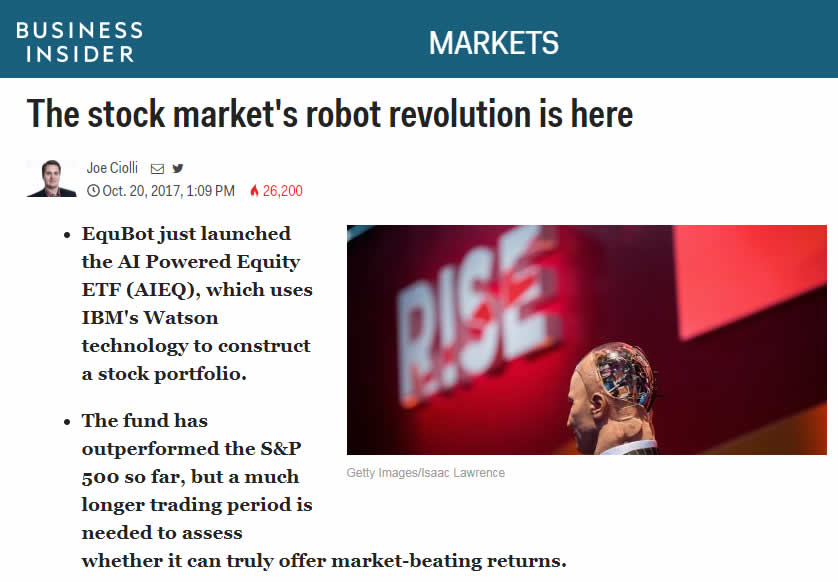
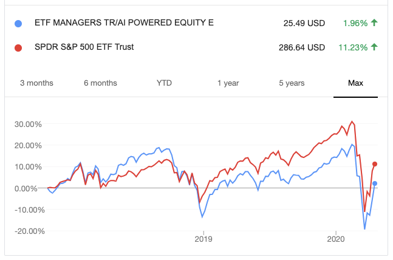

 
<style>
  body {font-size: 13pt; line-height:2.0;}
  pre code {font-size: 12pt;}
  .emred {color: red;}
  .emblue {color: blue;}
  .emgreen {color: green;}
</style>

 

```{r setup, include=FALSE}
options(width=90)
knitr::opts_chunk$set(echo = TRUE, message=FALSE, warning=FALSE)
```

**What's covered in this lecture?**

* AIEQ: artificial intelligence-powered ETF
* ETF perfomance and holdings
* Portfolio analysis
* Markowitz efficient frontier visualization


# AI-powered ETF

- The EquBot website: https://equbot.com/

- In October 2017, many news headlines read like this:

```{r, out.width = "600px", fig.align='left', echo=FALSE}

```

- It is comprised of  U.S. listed stocks and real estate investment trusts.


- Two years later, CNBC's discussion about AIEQ, titled "Man vs. Machine" 

<iframe width="560" height="315" src="https://www.youtube.com/embed/ses7Y5IIrpw" frameborder="0" allow="accelerometer; autoplay; encrypted-media; gyroscope; picture-in-picture" allowfullscreen></iframe>

- As a matter of fact, it has been downperforming the SPY (SPDR S&P 500 ETF) since late 2018.  

```{r, out.width = "600px", fig.align='left', echo=FALSE}

```

# AIEQ Performance 


For publicly traded NYSE:AIEQ, we may use `R:quantmod` to retrieve the historical market data (daily only) and visualize them by the candle stick chart through interactive `plotly` tools. 

```{r fig.align="center", fig.width=8, fig.asp=0.8}
library(quantmod)
library(plotly)
# date0 = "2017-10-01"
date0 = "2019-06-01"
dummy = getSymbols("AIEQ", src="yahoo", from = date0)
TmpX = as.data.frame(AIEQ)
TmpX$Date = row.names(TmpX)
TmpX %>% plot_ly(x = ~Date, type="candlestick",  text =NULL,
        open = ~`AIEQ.Open`, close = ~`AIEQ.Close`, 
        high = ~`AIEQ.High`, low = ~`AIEQ.Low`) %>% 
  layout(title = "EquBot AIEQ: Candlestick Chart")
```  

# ETF Holdings 

- Collect the daily holdings data from https://etfmg.com/funds/aieq/. (Remarks: Here we use an old collection in November 2017)

- Investigate how the ETF portoflio changes in terms of asset shares 

- Use the interactive heatmap and line plots to understand reallocation and rebalancing 


```{r eval=FALSE, echo=FALSE}
tmp = list.files("./Data")
tmp = tmp[grep("AIEQ_fund_holdings_", tmp)]
DataW = NULL
for (i in 1:length(tmp)){
  tmp1 = read.csv(paste("./Data/", tmp[i], sep=""))
  date1 = gsub(".csv", "", gsub("AIEQ_fund_holdings_", "", tmp[i]))
  DataW = rbind(DataW, cbind(date1, tmp1[,-2]))
}
names(DataW) = c("Date", "Ticker", "Share", "MarketValue", "Holding")
DataW$Date = as.POSIXlt(DataW$Date, format="%m%d%Y")
DataW$Holding = as.numeric(gsub("%", "", DataW$Holding))
levels(DataW$Ticker)[levels(DataW$Ticker)=="FCE/A"] = "FCE-A"
write.csv(DataW,  file="DataW.csv", row.names=F)
```


```{r fig.align="center", fig.width=9, fig.asp=1.1}
DataW = read.csv("DataW.csv")
DataW = DataW[order(DataW$Date, DataW$Ticker),]
DataW1 = data.frame(Date=unique(DataW$Date))
DataW1$Date1 = as.numeric(DataW1$Date)
for (i in 1:nlevels(DataW$Ticker)){
  tmp = levels(DataW$Ticker)[i]
  tmp1 = DataW[DataW$Ticker == tmp, c("Date", "Share")]
  names(tmp1) = c("Date1", tmp)
  tmp1$Date1 = as.numeric(tmp1$Date1)
  DataW1 = merge(DataW1, tmp1, by="Date1", all.x=TRUE)
}
DataW1$Date1 = NULL

library(d3heatmap)
tmp2 = DataW1[,-1]
tmp2[is.na(tmp2)] = 0
row.names(tmp2) = DataW1$Date
d3heatmap(t(tmp2), scale = "column", xaxis_font_size=10,
          color = scales::col_quantile("Blues", NULL, 12),
          dendrogram = "row", k_row=5)
```


```{r fig.align="center", fig.width=7, fig.asp=0.6}
set.seed(4)
RandIdx = sample(2:ncol(DataW1), 10)
RandIdx = RandIdx[order(colMeans(DataW1[, RandIdx], na.rm=T))]
par(mar=rep(2,4)) 
matplot(DataW1[,RandIdx], col=rainbow(10),
        type="s", lty=1, lwd=2,
        xaxt="n", yaxt="n",
        # xlab="Transaction day", ylab="Shares",
        main="Nearly Piecewise-Constant Shares")
```


# Porfolio Analysis 

* We demonstrate the use of `R:PerformanceAnalytics` and `R:fPortfolio` (based on [Portfolio Optimization with R/Rmetrics](https://www.rmetrics.org/ebooks-portfolio)) for portfolio analysis.

* For illustrative purpose, we retrieve the daily prices of each underlying asset from Yahoo!Finance. In real practice, it is recommended to use intra-day prices/returns. 


```{r eval=FALSE}
library(quantmod)
LatestPortfolio = read.csv('AIEQ_fund_holdings20200420.csv')
ListSymbol =  as.character(LatestPortfolio$StockTicker)
date0 = "2020-01-01"
dummy = getSymbols(ListSymbol, src="yahoo", from = date0)
DataX = NULL
for (i in 1:length(ListSymbol)){
  eval(parse(text=paste("TmpX = as.data.frame(`",
                        ListSymbol[i],"`)", sep="")))
  TmpX = data.frame(Date = row.names(TmpX), 
                    Price = TmpX[,6])  
  names(TmpX)[2] = ListSymbol[i]
  if(i==1) {DataX = TmpX} else {
    DataX = merge(DataX, TmpX, by="Date")
    }
}
DataX$Date = as.POSIXlt(DataX$Date, format="%Y-%m-%d")
write.csv(DataX, file="LatestDataX.csv", row.names=F)
```

```{r fig.align="center", fig.width=8, fig.asp=0.6}
library(PerformanceAnalytics)
library(reshape2)
DataX = read.csv("LatestDataX.csv")
names(DataX)[names(DataX)=="BF.B"] = "BF-B"
DataX = as.xts(DataX[, -1], order.by = as.Date(DataX$Date))
DataX.Ret = Return.calculate(DataX)[-1,]
tmpdata = melt(data.frame(Date = index(DataX.Ret), DataX.Ret), id.var="Date")
plot_ly(tmpdata, x=~Date, y=~value) %>%
  add_lines(color = ~ variable,  
            colors=rainbow(10, alpha=0.6)) %>% 
  layout(title = "Historical Asset Returns", showlegend = FALSE)
```

Next we compute the sample mean and covariance matrix based on historical returns. For simplicity, strong homogeneity is assumed. 

```{r fig.align="center", fig.width=8, fig.asp=0.8}
library(fPortfolio)
library(d3heatmap)
DataTS = as.timeSeries(DataX.Ret)
rescov = covEstimator(DataTS)
plot_ly(x = ~names(rescov$mu), y = ~rescov$mu, type = "bar") %>%
  layout(yaxis=list(title="Expected Return"),
         xaxis=list(title="", categoryarray = ~names(rescov$mu),
                    categoryorder = "array"))
d3heatmap(rescov$Sigma, dendrogram = "both")
```


#  Markowitz Efficient Frontier 
```{r fig.align="center", fig.width=9, fig.asp=0.8}
Spec <- portfolioSpec()
setSolver(Spec) <- "solveRquadprog"
setEstimator(Spec) <- "shrinkEstimator"
Frontier <- portfolioFrontier(DataTS, spec=Spec, constraints = "LongOnly")
portxy = frontierPlot(Frontier, frontier="both", type="l", 
                      col=c(2,4), lwd=2, xlim=c(0,0.05))
minvariancePoints(Frontier, col=1, cex=1.2) #the MVP point
singleAssetPoints(Frontier)
```

Alternatively, we may use `plotly` to interactively visualize the efficient frontier, the underlying assets, and the AIEQ position. 

```{r fig.align="center", fig.width=9, fig.asp=0.6}
LatestPortfolio = read.csv('AIEQ_fund_holdings20200420.csv')
w = as.numeric(gsub("%", "", as.character(LatestPortfolio$Weightings)))
w = w/sum(w)
plot_ly() %>%
  add_markers(x=sqrt(diag(rescov$Sigma)), y=rescov$mu, size=w,
              hoverinfo="text", text=~names(rescov$mu),
              name="Individual Assets") %>%
  add_trace(x = portxy[,1], y = portxy[,2], type="scatter", mode="lines",
            name="Efficient Frontier") %>%
  add_trace(x = sqrt(t(w)%*%rescov$Sigma%*%w), y = sum(w*rescov$mu), 
            type="scatter", mode="markers", size=2,
            name="AIEQ Position at 20/04/2020") %>%
  layout(title = "How Efficient Does AIEQ Perform?",legend=list(orientation = 'h')) 
```

 

We may use the above procedure to keep tracking the AIEQ performance by e.g. taking a moving-window apporach. We may also improve the analysis by intra-day data whenever available. 

<br />
<br />