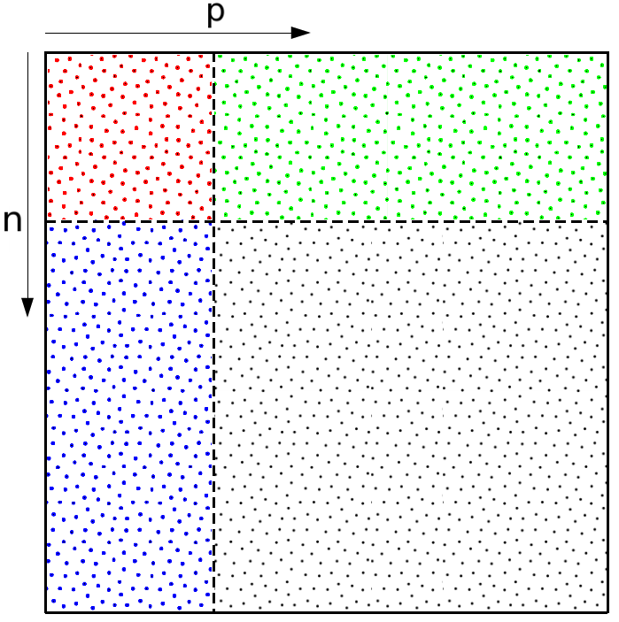
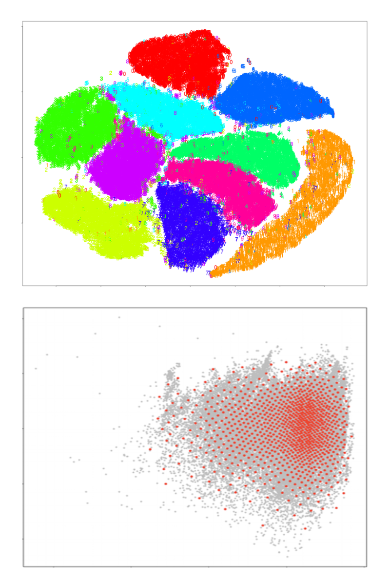
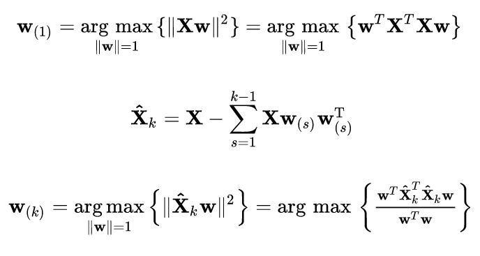
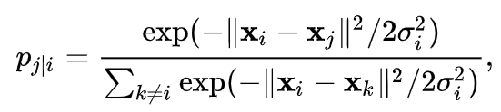
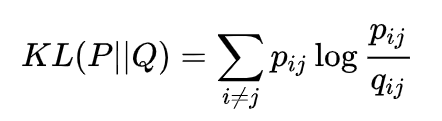
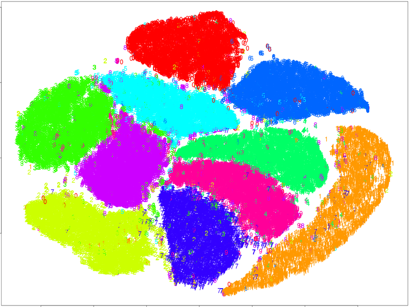

```{r setup, include=FALSE}
options(htmltools.dir.version = FALSE)
options(width=90)
knitr::opts_chunk$set(cache = FALSE, message=FALSE, warning=FALSE)
```

# Big Data Visualization



Big data often come with two distinct features: 

- Big n (number of observations): large-scale

- Large p (number of features): high-dimensional

<br>

Challenging tasks when exploring big data in the context of unsupervised learning

- Large-scale clustering 

- Dimension reduction (when p is large)

---
# Two BigDataViz Approaches 




In this lecture, we discuss two different approaches for big data visualization: 

- Dimension Reduction
  
  - PCA-based K-means Clustering
  
  - t-SNE Visualization
  
- Subsampled Data Exploration


 


---
class: center, middle

# Dimension Reduction

### From PCA to t-SNE

---
# Principal Component Analysis

PCA is to project the data to a new coordinate system such that the greatest variance lies on the first coordinate (i.e. the first principal component), the second greatest variance on the second principal component, and so so. 

```{r, fig.align = "center", out.width = "600px", echo=FALSE}

```

---
# Principal Component Analysis

.pull-left[
```{r}
DataX = data.frame(x1 = iris$Sepal.Length, 
                   x2 = iris$Petal.Width)
(tmp = prcomp(DataX))
```
]

.pull-right[
```{r fig.align="center", fig.width=5, fig.asp=1, echo=FALSE}
par(mar=c(1,1,2,1))
plot(DataX$x1, DataX$x2, pch=19, asp=1)
arrows(tmp$center[1], tmp$center[2], 
       tmp$center[1] + 2*tmp$sdev[1]*tmp$rotation[1,1], 
       tmp$center[2]+2*tmp$sdev[1]*tmp$rotation[2,1],
       col=2, lwd=2, angle=20, length=0.2)
arrows(tmp$center[1], tmp$center[2], 
       tmp$center[1] + 2*tmp$sdev[2]*tmp$rotation[1,2], 
       tmp$center[2]+2*tmp$sdev[2]*tmp$rotation[2,2],
       col=4, lwd=2, angle=20, length=0.2)
text(tmp$center[1] + 2*tmp$sdev[1]*tmp$rotation[1,1], 
     tmp$center[2]+2*tmp$sdev[1]*tmp$rotation[2,1]+0.1,
     'w1', col=2)
text(tmp$center[1] + 2*tmp$sdev[2]*tmp$rotation[1,2], 
     tmp$center[2]+2*tmp$sdev[2]*tmp$rotation[2,2]+0.1,
     'w2', col=4)
title(main="Principal Directions")
```
]

---
# PCA-based K-means Clustering 
```{r fig.align="center", fig.width=9, fig.asp=0.5, echo=TRUE, eval=T}
pr = prcomp(iris[,1:4]) # Use all four variables 
par(mfrow=c(1,2), mar=rep(4,4))
barplot(pr$sdev^2/sum(pr$sdev^2), xlab="PC", ylab="Percentage", main="Variance Explained")
PCx = pr$x[,1:2]; kk = 3; set.seed(1); fit = kmeans(PCx, kk)
plot(PCx[,1], PCx[,2], pch=19, cex=1, col=seq(2,1+kk)[fit$cluster], 
     xlab="PC1", ylab="PC2", main="K-means on PC scores")
points(fit$centers, pch=10, cex=2, col=seq(2,1+kk))
```
 

---
# t-Distributed Stochastic Neighbor Embedding

- Considering a Gaussian distribution around $x_i$ with a given variance $\sigma_i^2$, where $\sigma_i$ is smaller for the points in the sense areas than the points in the sparse areas. 

- Similarity index: $p_{ij} = \frac{p_{j|i} + p_{i|j}}{2N}$, based on the conditional simlarity between data points: 
```{r fig.align="center", out.width = "300px", echo=FALSE}

``` 
<!-- $$p_{j|i} = \frac{\exp\left(-\left| x_i - x_j\right|^2 \big/ 2\sigma_i^2\right)}{\sum_{k \neq i} \exp\left(-\left| x_i - x_k\right|^2 \big/ 2\sigma_i^2\right)}$$ -->


- t-SNE uses the heavy-tailed t-Student distribution with one degree of freedom (i.e. Cauchy distribution) instead of a Gaussian distribution.

- t-SNE algorithm determines the locations of point maps in 2D by minimzing the Kullack-Leibler divergence using the gradient descent. 
```{r fig.align="center", out.width = "300px", echo=FALSE}

``` 

---
# t-SNE illustrated 

```{r fig.align="center", out.width = "420px", echo=FALSE}
knitr::include_graphics("tSNE_animation.gif")
``` 
Source:  [An illustrated introduction to the t-SNE algorithm](https://www.oreilly.com/learning/an-illustrated-introduction-to-the-t-sne-algorithm)

See also: [How to Use t-SNE Effectively](https://distill.pub/2016/misread-tsne/)


---
```{r  fig.align="center", fig.width=6, fig.asp=0.9, eval=T}
library(Rtsne)
iris_unique <- unique(iris) # Remove duplicates
iris_matrix <- as.matrix(iris_unique[,1:4])
par(mar=c(2,2,2,2)); set.seed(1)
tsne_out <- Rtsne(iris_matrix,pca=FALSE,perplexity=30,theta=0.0) # Run TSNE
plot(tsne_out$Y, col=as.numeric(iris_unique$Species)+1)
```

---
# t-SNE on a large MNIST data with 60K sample 

- Refer to STAT3612-Lecture 12 [MNIST Case Study](http://www.statsoft.org/wp-content/uploads/2018Stat3612/Lecture12_CaseMNIST/Lecture12_CaseMNIST.html) about the data background. 

```{r fig.align="center", out.width = "600px", echo=FALSE}

``` 

```{r  fig.width=7, fig.asp=1.1, eval=FALSE, echo=FALSE}
library(Rtsne)
DataX = read.csv("TrainMNIST3K.csv", header=F)
tsne <- Rtsne(DataX, dims = 2, perplexity=30, verbose=TRUE, max_iter = 500)

tsne <- Rtsne(DataX, dims = 2, perplexity=30, verbose=TRUE, theta=0.0)

plot(tsne$Y, t="n")
text(tsne$Y, labels=DataX$Label, col=cmp[DataX$Label])


tmp = read.csv("TrainMNIST3K_label.csv", header=F)
DataX$Label = as.factor(unlist(tmp))
cmp = rainbow(length(unique(DataX$Label)))
tsne <- Rtsne(DataX[,-785], dims = 2, perplexity=30, verbose=TRUE, max_iter = 500)
plot(tsne$Y, t='n', main="tsne")
text(tsne$Y, labels=DataX$Label, col=cmp[DataX$Label])
```


---
class: center, middle

# 2: Subsampled Data Exploration

<br>

Click for a [recent presentation](20181110DSD_Nankai.pdf)


---
class: center, middle

# Thank you! 

Q&A or Email ajzhang@umich.edu。


