```{r setup, include=FALSE}
options(htmltools.dir.version = FALSE)
options(width=120)
knitr::opts_chunk$set(cache = TRUE, message=FALSE, warning=FALSE)
```

# What's covered in this lecture?

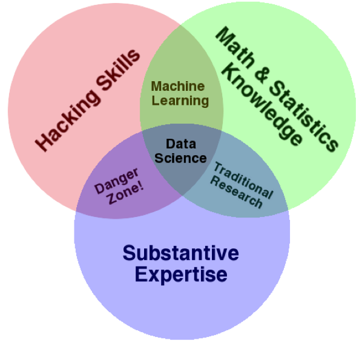


- STAT3622 Course Outline  

  - Course Objectives
  - Tentative Contents  
  - Assessments
  - Refereces 
  
- RStudio and R Markdown


- Introduction to Data Science   

  - DS Job Market  
  - DS Venn Diagram  
  - DS Workflow  

  
---
class: center, middle

# 1. STAT3622 Course Outline


---
# Course Admin Information

```{r echo=FALSE, fig.align="center", out.width = '40%'}

```
 
- Instructor: Dr. Aijun Zhang

  - Office: RR224  
  - Email: ajzhang@hku.hk

- Lecture Hours:

  - Tuesday 1:30pm - 4:20pm (T5)  

- Tutor: Mr. Yifeng Guo

  - Office: RR114  
  - Email: gyf9712@hku.hk

---
# Course Websites

- http://stat3622.saas.hku.hk/  

  * Weekly updates with various course materials 
  
  <!-- * A public domain for also hosting your DataViz projects -->

 

- http://moodle.hku.hk/  

  * Sync with lecture notes/assignments/etc

  * Annoucements, reminders, and surveys 

<!-- - Rstudio server:  http://stat3622.saas.hku.hk:8787/ -->


---
# Course Objectives

- This course (as part of data science) will focus on statistical graphics and interactive data visualization, as well as their applications in real case studies. 

- **Programming:** R (primary), Python, D3.js

- **You will learn:**

  - Choose the best chart that fits the data

  - Communicate effectively using statistical graphics

  - Create compelling visualization via programming tools

- **Prerequisites:** STAT2602 (Probability & Statistics II) or STAT3902 (Statistical Models)


---
# Tentative Contentes

.pull-left[
- Introduction to Data science 

- Exploratory data analysis

- Data manipulation

- Hans Rosling's Bubbles

- Interactive data visualization

- Shiny

- Web scrapping

- Dynamic documentation

- Big data visualization

]

.pull-right[
1. Statisticla Graphics  
  * R base plot
  * R:lattice
  * R:ggplot2 

1. Interactive Data Visualization  
  * R:magick/animation
  * R:plotly (based on d3.js)
  * Rstudio:shiny 

1. Selected Topics
  * Spatiotemporal DataViz
  * Map visualization
  * Web scrapping, etc 
]


---
# Assessments

- No Final Exam!  

- 40% Homeworks (2 sets) and in-class quizzes (2 sets);

- 60% Final project, consisting of   

   - DataViz app: 30%   
   
   - Oral presentation: 15%     
   
   - Written report: 15%   


---
# References

- *R for Data Science* (2017 O'Reilly) by Grolemund and Wickham. http://r4ds.had.co.nz/

- Wickham, H. (2016). *ggplot2: Elegant Graphics for Data Analysis* (2nd). 
Springer. http://ggplot2.org/book/

- Rossant, C. (2015). *Learning IPython for Interactive Computing and Data Visualization* (2nd). Packt. http://ipython-books.github.io/minibook/

- Meeks, E. (2017) *D3.js in Action* (2nd Edition, 2017 Manning)   https://www.manning.com/books/d3js-in-action-second-edition 

- Yau, N. (2011). *Visualize This: The FlowingData Guide to Design, Visualization, and Statistics*. Wiley. http://book.flowingdata.com/ 

- *RStudio Cheat Cheets*. https://www.rstudio.com/resources/cheatsheets/

---
class: center, middle

# RStudio and R Markdown


---
# RStudio IDE

- RStudio is a popular IDE (Integrated Development Environment) for R programming

- It is a powerful editor for R coding and debugging.

- It is a powerful generator for HTML, PDF, dynamic documents and slide shows.

- RStudio can be run on both Desktop and Cloud. 
<!-- In this course, we provide the RStudio Server:  http://stat3622.saas.hku.hk:8787  -->

- Check out more nice features of RStudio at its [official website](https://www.rstudio.com/products/rstudio/features/)


---
# RStudio IDE

```{r echo=FALSE, fig.align="center", out.width = '60%'}
knitr::include_graphics("RStudio-Screenshot.png")
```

---
# R Markdown (Demonstrated)

```{r}
knitr::kable(head(iris), format = 'html')
```

- Dynamic documentation:  report, table, graphics ... 

- R packages by Yihui Xie: knitr, bookdown, xaringan, etc

---
# R Markdown (Demonstrated)

```{r fig.align='center', fig.width=5, fig.asp=1}
plot(iris, col=iris$Species)  
```

- Data-generated graphics that are reproducible 

---
# R Markdown 

 
```{r echo=FALSE, fig.align="center", out.width = '60%'}
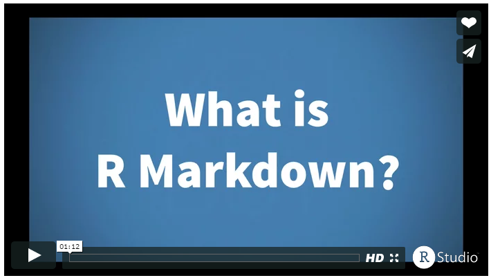
```

- Click [here](https://rmarkdown.rstudio.com/lesson-1.html) to view a fantastic micro-video tutorial 

- Browse [here](http://rmarkdown.rstudio.com/gallery.html) for a gallery of creative Rmarkdown works  


---
class: center, middle

# Introduction to Data Science
 
---
#  Data Scientist The Sexy Job


```{r echo=FALSE, fig.align="center", out.width = '75%'}
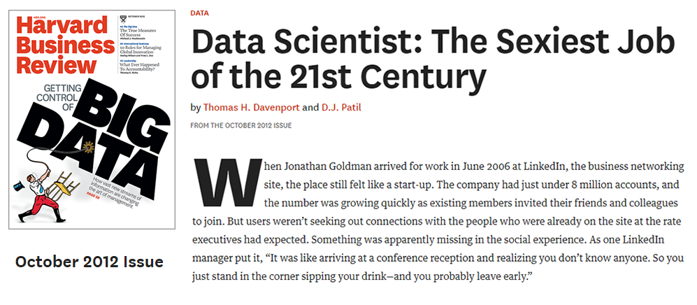
```

- See also an old article by NYT (2009): [For Today’s Graduate, Just One Word: Statistics](https://www.nytimes.com/2009/08/06/technology/06stats.html)

- And another famous McKinseay 2011 Report: 
[Big data: The next frontier for innovation, competition, and productivity](https://www.mckinsey.com/business-functions/digital-mckinsey/our-insights/big-data-the-next-frontier-for-innovation)

---
#  What is a data scientist?

- Nate Silver ([FiveThirtyEight](https://fivethirtyeight.com/contributors/nate-silver/), author of The Signal and the Noise): "Data scientist is just a sexed up word for a statistician.


- "A data scientist is someone who knows more statistics than a computer scientist and more computer science than a statistician.” (from [Joshua Blumenstock](http://www.jblumenstock.com/teaching/course=infx573))


```{r echo=FALSE, fig.align="center", out.width = '75%'}
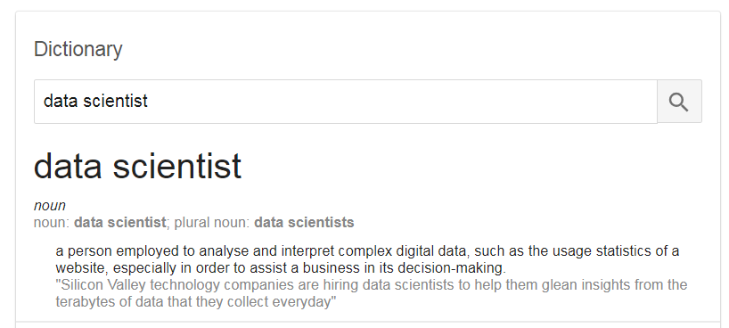
```

---
#  What is a data scientist?

```{r echo=FALSE, fig.align="center", out.width = '50%'}
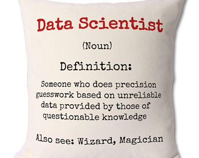
```


<!-- --- -->
<!-- #  Job Market of Data Scientist  -->

<!-- ```{r echo=FALSE, fig.align="center", out.width = '70%'} -->
<!-- 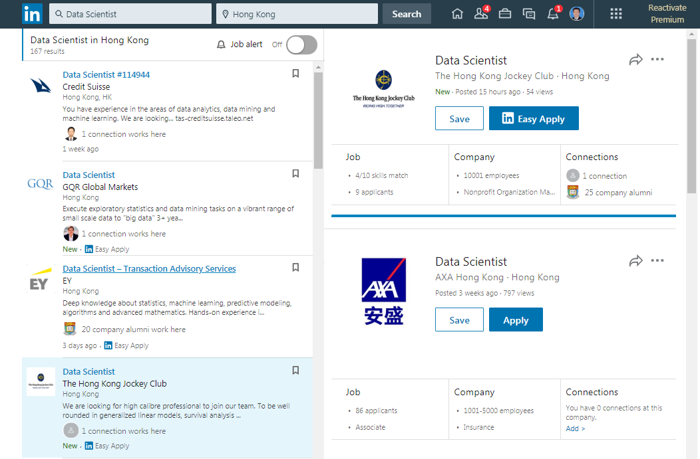 -->
<!-- ``` -->

<!-- --- -->
<!-- #  Innovation Technologies  -->


<!-- Big Data,  Data Science, Machine Learning, Artificial Intelligence, Deep Learning, and Statistics -->

<!-- ```{r echo=FALSE, fig.align="center", out.width = '50%'} -->
<!-- knitr::include_graphics("InnovationTechnology.jpg") -->
<!-- ``` -->

<!-- - [A BMC Blog Post](https://www.bmc.com/blogs/machine-learning-data-science-artificial-intelligence-deep-learning-and-statistics/) about these innovative technology terms  -->

<!-- - [Another blog post](https://www.newgenapps.com/blog/artificial-intelligence-vs-machine-learning-vs-data-science) about "Artificial Intelligence vs Machine Learning vs Data Science" -->


<!-- --- -->
<!-- #  AI is Statistics  -->

<!-- ```{r echo=FALSE, fig.align="center", fig.cap="HKU SAAS Orientation Day, 4/9/2018", out.width = '55%'} -->
<!-- 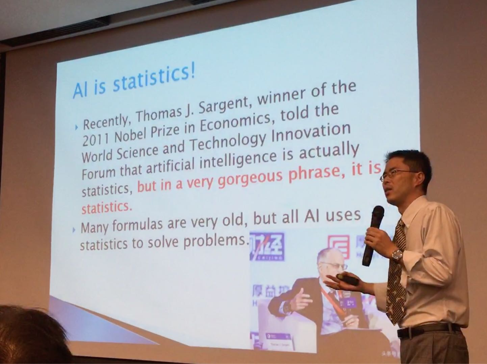 -->
<!-- ``` -->


---
#  From Big Data to Applied AI

```{r echo=FALSE, fig.align="center", fig.cap="HKU New BASc Programme in Applied AI (2019 onwards)", out.width = '70%'}
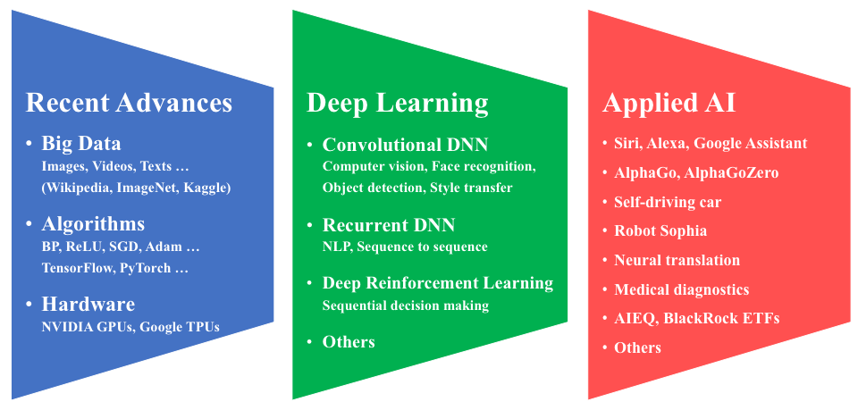
```


---
#  Data Science Venn Diagram


```{r echo=FALSE, fig.align="center", out.width = '45%'}

```


---
#  Data Science vs. Statitics 

.pull-left[
```{r echo=FALSE, fig.align="center", out.width = '90%'}
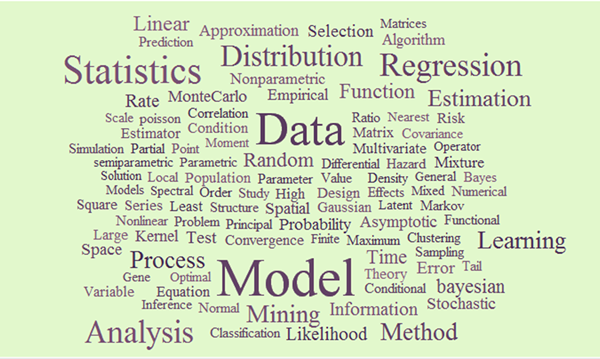
```
]
.pull-right[
```{r echo=FALSE, fig.align="center", out.width = '90%'}
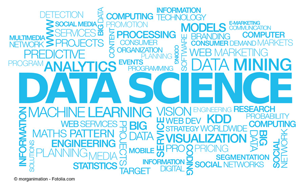
```
]


---
#  Data Science Workflow


```{r echo=FALSE, fig.align="center", out.width = '50%'}
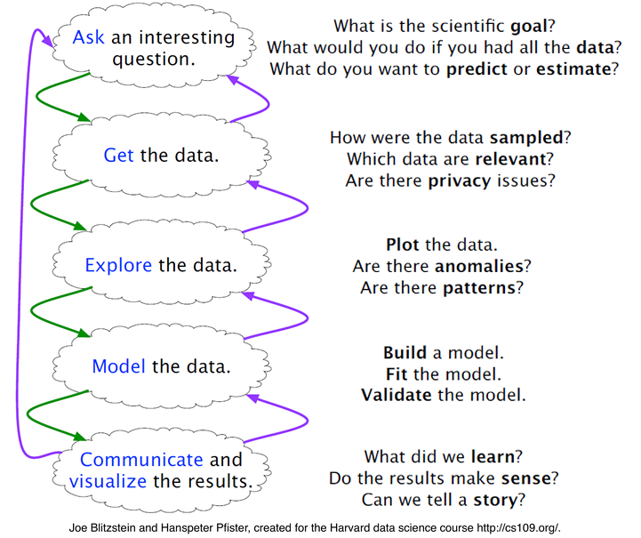
```

---
#  Data Science Workflow

```{r echo=FALSE, fig.align="center", out.width = '70%'}
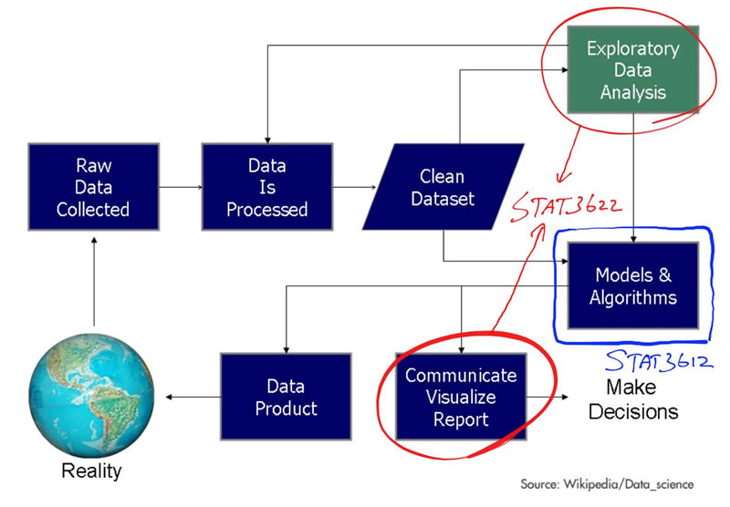
```


---
#  Roles of Data Visualization


- Role 1: Exploratory data analysis (pre stage);

- Role 2: Visual presentation of results (after stage).

- John W. Tukey (1977; Exploratory Data Analysis):  "The greatest value of a picture is when it forces us to notice what
we never expected to see.”


.pull-left[
```{r echo=FALSE, fig.align="center", out.width = '47%'}

```
]
.pull-right[
```{r echo=FALSE, fig.align="center", out.width = '40%'}
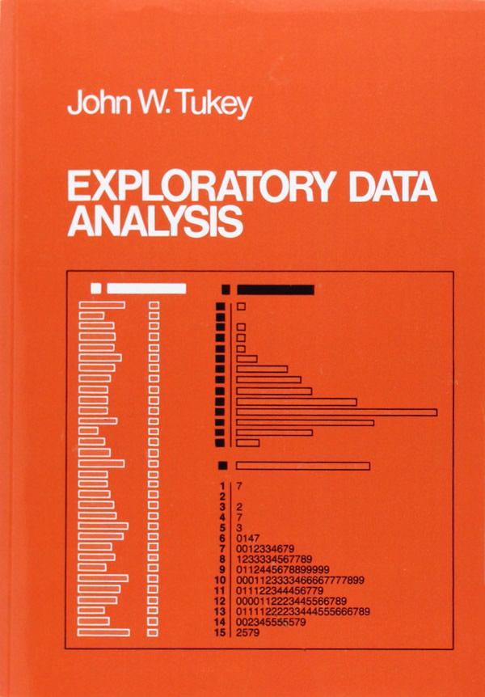
```
]


---
class: center, middle

## The best stats you've ever seen | Hans Rosling


<iframe width="560" height="315" src="https://www.youtube.com/embed/hVimVzgtD6w" frameborder="0" allow="accelerometer; autoplay; encrypted-media; gyroscope; picture-in-picture" allowfullscreen></iframe>

Click [here](https://www.youtube.com/embed/hVimVzgtD6w) to view it on YouTube. 

---
class: center, middle

# Thank you! 

Q&A or Email ajzhang@umich.edu。


