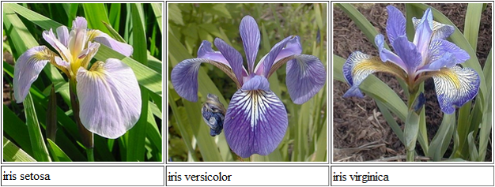

```{r setup, include=FALSE}
options(htmltools.dir.version = FALSE)
options(width=120)
knitr::opts_chunk$set(cache = TRUE, message=FALSE, warning=FALSE)
```

# What's covered in this lecture?


I. Exploratory Data Analysis

  - John Tukey
  - Exploratory Data Analysis

II. Simple Base Graphics
  - Iris Dataset
  - Basic R Plots

III. Using R:Lattice Package   
  - Conditioning and Grouping
  - Cloud and Level Plots
 
  
---
class: center, middle

# I. Exploratory Data Analysis  

 
---
#  Review: Data Science Workflow

```{r echo=FALSE, fig.align="center", out.width = '66%'}
knitr::include_graphics("DSWorkflow.jpg")
```

---
# Roles of Data Visualization

- Role 1: Exploratory data analysis (pre stage);

- Role 2: Visual presentation of results (after stage).

- John W. Tukey (1977; Exploratory Data Analysis):  "The greatest value of a picture is when it forces us to notice what we never expected to see.”


.pull-left[
```{r echo=FALSE, fig.align="center", out.width = '47%'}
knitr::include_graphics("JohnTukey.png")
```
]
.pull-right[
```{r echo=FALSE, fig.align="center", out.width = '40%'}

```
]


---
# John Tukey (1915-2000)


- Proposed “Exploratory Data Analysis”  

- Coined terms: Boxplot, Stem-and-Leaf plot, ANOVA (Analysis of Variance)  

- Coined terms “Bit” and “Software”  

- Co-Developed Fast Fourier Transform algorithm, Projection Pursuit, Jackknife estimation  

- Famous quote: “The best thing about being a statistician is that you get to play in everyone's backyard.”
 
- https://en.wikipedia.org/wiki/John_Tukey 


---
# John Tukey: The Future of Data Analysis (1962)

```{r, fig.align = "center", out.width = "800px", echo=FALSE}

```
 
- Reference: [Donoho, David (2017). "50 Years of Data Science" at *JCGS*, **26**(4), 745-766.](https://www.tandfonline.com/doi/abs/10.1080/10618600.2017.1384734)
 
---
# John Tukey: Exploratory Data Analysis (1977)


- Five-number summary

- Stem-and-Leaf plot

- Scatter plot

- Box-plot, Outliers

- Residual plot

- Smoother

- Bag plot

 
---
# Example: Anscombe Dataset
 

```{r echo=FALSE, out.width = "800px"}
library(knitr)
cat("Anscombe Dataset:")
DataX = anscombe[,c(1,5,2,6,3,7,4,8)]
kable(DataX,format = "html")  
```

Source: Anscombe, F. J. (1973). Graphs in statistical analysis. *American Statistician*, **27**, 17-21.


---
# Example: Anscombe Dataset (Descriptive)
 

```{r echo=FALSE}
cat("Mean and standard deviation:")
kable(t(data.frame(mean= apply(DataX, 2, 'mean'),
                   sd = apply(DataX, 2, 'sd'))), digits=2,format = "html")
cat("x-y correlation:")
kable(data.frame(rho1 = cor(DataX$x1, DataX$y1),
                   rho2 = cor(DataX$x2,DataX$y2),
                   rho3 = cor(DataX$x3,DataX$y3),
                   rho4 = cor(DataX$x4,DataX$y4)), digits=2,format = "html")
```

---
# Example: Anscombe Dataset (Graphic)

```{r fig.align='center', fig.width=7, fig.asp=1, echo=FALSE}
tmpplot = function(x,y) {plot(x,y, pch=19, cex=1.5, col=4); abline(lm(y~x), col=2)}
par(mfrow=c(2,2))
tmpplot(DataX$x1, DataX$y1); tmpplot(DataX$x2, DataX$y2)
tmpplot(DataX$x3, DataX$y3); tmpplot(DataX$x4, DataX$y4)
```


---
# Exploratory Data Analysis

The EDA is a statistical approach to make sense of data by using a variety of techniques (mostly graphical). It may help us 

- Assess assumption about variables distribution  

- Identify relationship between variables   

- Extract important variables  

- Suggest use of appropriate models  

- Detect problems of collected data (e.g. outliers, missing data, measurement errors)


---
# Statistical Graphics

- **Univarite**  
  * Histogram, Stem-and-Leaf, Dot, Q-Q, Density plots 
  * Boxplot, Box-and-whisker
  * Bar, Pie, Polar, Waterfall charts

- **Bivariate**  
  * XYplot, Line, Area, Scatter, Bubble charts
  
- **Trivariate**  
  * 3D Scatter, Contour, Level/Heatmap, Surface plots


---
# Which Chart to Use?

```{r, fig.align = "center", out.width = "700px", echo=FALSE}

```


---
class: center, middle

# II. Simple Base Graphics


---
# Iris Dataset 

```{r, fig.align = "center", out.width = "600px", echo=FALSE}

```

```{r}
DataX = iris   # ?iris
str(DataX)
```

---
```{r}
dim(DataX)
head(DataX)  # tail
summary(DataX)
```


---
# Basic R Plots: Histogram and Density Plot

```{r fig.align='center', fig.width=11, fig.asp=0.35}
x = DataX$Sepal.Length # a continuous variable
par(mfrow=c(1,3))
hist(x, main='Histogram (Default)')   
hist(x, breaks=20, col=5, main='More Bins and Coloring') 
hist(x, breaks=20, freq=F, main='Histogram plus Density Plot')   # using freq=FALSE
lines(density(x), col=2, lty=1, lwd=2)  #add the density curve
```


---
# Basic R Plots: Boxplot  

```{r fig.align='center', fig.width=11, fig.asp=0.4}
par(mfrow=c(1,3))
boxplot(DataX$Sepal.Width, main='Boxplot of Sepal.Width')  # Outliers
boxplot(DataX[,1:4], col=c(2,3,4,5), main='Side-by-side Boxplot')  
boxplot(Sepal.Width~Species, DataX, col=c(6,7,8), main="Boxplot with Grouping") 
```

---
# Basic R Plots: Pie and Bar Charts 

```{r fig.align='center', fig.width=11, fig.asp=0.35}
DataX$Flag = DataX$Sepal.Length>5 # Create a binary flag
par(mfrow=c(1,3))
pie(table(DataX$Species[DataX$Flag]), col=c(2,3,4))
barplot(table(DataX$Species[DataX$Flag]), col=c(5,6,7))
barplot(table(DataX$Species, DataX$Flag), col=c(5,6,7), beside=T)
```


---
# Relationship Between Variables

```{r fig.align='center', fig.width=9, fig.asp=0.4}
x = DataX$Petal.Length; y = DataX$Petal.Width; z = DataX$Species
par(mfrow=c(1,2)); par(mar=c(4,4,1,4))
plot(x, y, xlab="Petal.Length", ylab="Petal.Width") 
abline(coef(lm(y~x)), col=1, lty=2)
plot(x, y, col=c(2,3,4)[z], pch=20, cex=2.0, xlab="Petal.Length", ylab="Petal.Width") 
abline(lm(y~x), col=1, lty=2) 
legend("topleft", levels(z), pch=20, col=c(2,3,4))
```

---
# Pairwise Scatter Plot

.pull-left[
```{r fig.align='center', fig.width=6, fig.asp=1.0}
plot(DataX, col=DataX$Species,
     main="Pairwise Scatter Plot") 
```
]

.pull-right[
```{r fig.align='center', fig.width=5.5, fig.asp=1.0}
pairs(DataX[,1:4], panel = panel.smooth,
      col = c(4,5,6)[DataX$Species], 
      main="More Sophisticated") 
```
]


---
class: center, middle

# III. Using R:Lattice Package 


---
# R:Lattice


- Using trellis graphs for multivariate data  

- Multipanel conditioning and grouping  

- Elegant high-level data visualization  

- Covering most of statistical charts  

- Figures and Codes can be found at  
http://lmdvr.r-forge.r-project.org/

- However, plot customization are not so straightforward


---
# Univariate Distributions

```{r fig.align="center", fig.width=10, fig.asp=0.5}
library(lattice); library(gridExtra)
p1 = histogram(DataX$Sepal.Length)
p2 = bwplot(DataX$Sepal.Length) 
grid.arrange(p1, p2, ncol=2)
```

---
# Histogram with Conditioning
```{r fig.align="center", fig.width=10, fig.asp=0.4}
histogram(data=DataX, ~Sepal.Length|Species, breaks=12, layout = c(3, 1))
```


---
# Density plot with Grouping
```{r fig.align="center", fig.width=6, fig.asp=0.8}
densityplot(data=DataX, ~Sepal.Length, groups=Species,  
            plot.points=F, auto.key=list(space="top", columns=3))
```


---
# Boxplot with Grouping
```{r fig.align="center", fig.width=6, fig.asp=0.8}
bwplot(data=DataX, Sepal.Width~Species) 
```


---
# Bivariate plot with Grouping
```{r fig.align="center", fig.width=6, fig.asp=0.8}
xyplot(data=DataX, Sepal.Length ~ Petal.Length, groups = Species,  
       type = c("p", "smooth",  "g"),  
       auto.key = list(space="top", columns=3)) # grouping
```

---
# Bivariate plot with Conditioning
```{r fig.align="center", fig.width=6, fig.asp=1}
xyplot(data=DataX, Sepal.Length ~ Petal.Length|Species, 
       type=c("p", "smooth",  "g"), layout=c(1,3)) # conditioning
```

---
# Trivariate 3D Plot
```{r fig.align="center", fig.width=6, fig.asp=0.8}
cloud(data=DataX, Sepal.Length ~ Sepal.Length * Petal.Width, groups = Species, 
      auto.key = list(space="top", columns=3), panel.aspect = 0.8)
```


---
# Trivariate Heatmap  
```{r fig.align="center", fig.width=6, fig.asp=0.8}
dist = as.matrix(dist(DataX[,3:4]))
levelplot(dist, colorkey = T, col.regions = terrain.colors,
          scales = list(at=c(0,0),tck = c(0,0)), 
          xlab="",ylab="",main="Levelplot of Pairwise Distance Matrix")
```


---
class: center, middle

# Thank you! 

Q&A or Email ajzhang@hku.hk。


 