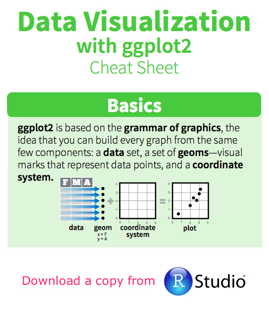
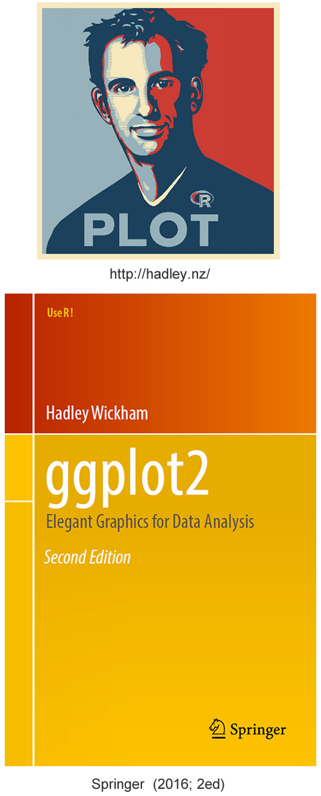
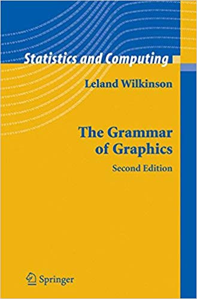
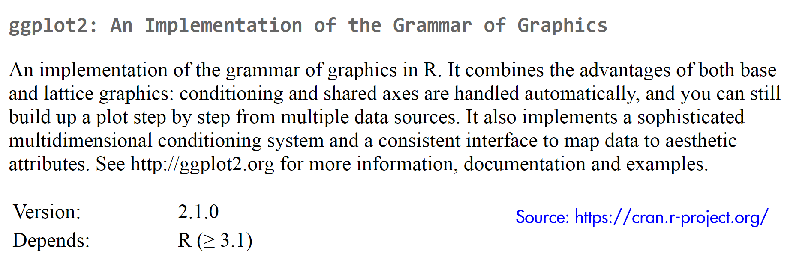
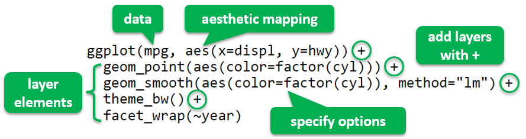

```{r setup, include=FALSE}
options(htmltools.dir.version = FALSE)
options(width=120)
knitr::opts_chunk$set(cache = TRUE, message=FALSE, warning=FALSE)
```

# What's covered in this lecture?

<a href="https://github.com/rstudio/cheatsheets/raw/master/data-visualization-2.1.pdf"> </a>

I. Grammar of Graphics  

  - Hadley Wickham and R:ggplot2
  
  - Layer-by-Layer Graphics

II. Quick plots with qplot()

III. Layer-by-layer ggplot()

IV. Options and themes  


---
class: center, middle

# I. Grammar of Graphics


---
# Hadley Wickham and R:ggplot2



- Chief scientist at RStudio, Creator of popular R packages: ggplot2, dplyr, tidyr, devtools, etc; “The man who r
evolutionized R” according to [Pricenomics (2015)](https://priceonomics.com/hadley-wickham-the-man-who-revolutionized-r/)

- R graphics: base -> lattice -> ggplot2

> "ggplot2, started in 2005, is an attempt to take the good things about base and lattice graphics and improve on them with a strong underlying model" (Hadley Wickham)

- R:ggplot2 is one of most commonly downloaded R packages 

- Based on Grammar of Graphics by Wilkinson (2005; Springer 2ed)

---
#Grammar of Graphics (GG)



Quote from the ggplot2 book that further quotes Wilkinson (2005):

> In brief, the grammar tells us that a statistical graphic is a mapping from data to aesthetic attributes (colour, shape, size) of geometric objects (points, lines, bars). The plot may also contain statistical transformations of the data and is drawn on a specific coordinate system. Facetting can be used to generate the same plot for different subsets of the dataset. It is the combination of these independent components that make up a graphic.

**Keywords:** mapping, aesthetic attributes, geometric objects, statistical transformations, coordinate system, facetting


---
# R:ggplot2 package
```{r, fig.align = "center", out.width = "700px", echo=FALSE}

```

- The most popular package for producing static visualizations in R; New upgrade to Version 3.2.1; See [CRAN](https://CRAN.R-project.org/package=ggplot2)  for updated information

- Online documentation at https://ggplot2.tidyverse.org/

- Download the useful [cheatsheet](https://github.com/rstudio/cheatsheets/raw/master/data-visualization-2.1.pdf) created by Rstudio, Inc.

- Also available in Python: http://ggplot.yhathq.com/


---
# Layer-by-Layer Graphics

```{r, fig.align = "center", out.width = "600px", echo=FALSE}

```

- **Aesthetics**: mapping data varialbes to aesthetic attributes (position, size, shape, color, ...)

- **Geometric objects**: point, line, polygon, histogram, quantile, bar, ...

- **Statistical transformations**: bin, boxplot, density, contour, function, ...

- Other components for ggplots: **scales** (mapping values of the data to visual values for each aesthetic, e.g. position, color, fill and shape scales), **coordinate system** (cartesian, polar, map projection, ..); **facet** (conditioning display split data in multi-panels; theme (control non-data visual elements (title, axes, tick, ...)


---
# Base, Lattice and ggplot2 styles (first impression)

.pull-left[
```{r fig.align="center",  fig.width=4, fig.asp = 0.5, echo=TRUE}
par(mar=c(1,3,1,0))
hist(iris$Sepal.Length) # Base graphics
```

```{r fig.align="center",  fig.width=6, fig.asp = 0.45, echo=TRUE}
library(lattice)
histogram(data=iris, ~Sepal.Length|Species) 
```
]

.pull-right[
```{r fig.align="center",  fig.width=6, fig.asp = 0.7, echo=TRUE}
library(ggplot2)
ggplot(data=iris,
       aes(x=Sepal.Length, fill=Species)) + 
  geom_histogram(bins=8) 
```
]


---
# You Will Learn ... 

- R:ggplot2 provides two ways/levels to build graphs:

  - qplot() - quick plot, supplies many defaults

  - ggplot() - grammar of graphics plot, with more controls

- Options and themes for making sophisticated ggplot2 graphs

- Later in this course, ggplot2 will also be used for animated/interactive plots


---
class: center, middle

# II. Quick plots with qplot()

---
# Quick Plots with qplot()

- qplot() is analog to base plot(), where "q" means quick

- qplot() may create a quick plot with minimum typing

- It defines a plot in a single call with the basic syntax:

<p style="text-align:center;color:red;">
qplot(dataframe, variables, [geom], options)
</p>

- Automatic use of default settings to make life easier.

- A sensible geom will be picked by default if it is not supplied.


---
# Histogram
```{r echo=FALSE}
library(ggplot2)
library(gridExtra)
```

```{r fig.align="center", fig.width=12, fig.asp = 0.24, echo=TRUE}
p1 = qplot(data = iris, Sepal.Length, geom="histogram") 
p2 = qplot(data = iris, Sepal.Length, fill = Species, bins = 8)  # default geom
p3 = qplot(data = iris, Sepal.Length, facets = .~Species, binwidth = 0.5)  
grid.arrange(p1,p2,p3, ncol=3)
```

- Histogram is the sensible geom for continuous variables

- Automatic color setting (color/fill are grouping variables in ggplot2)

- Faceting is similar to the conditioning function in Lattice

---
# Density plot

```{r fig.align="center", fig.width=7, fig.asp = 0.8, echo=TRUE}
qplot(data = iris, Sepal.Length, geom = "density",  fill = Species) 
```


---
# Boxplot with Grouping

```{r fig.align="center", fig.width=10, fig.asp = 0.5, echo=TRUE}
p1 = qplot(data = iris, Species, Sepal.Width, geom="boxplot", main="Boxplot")  
p2 = qplot(data = iris, Species, Sepal.Width, geom="violin", main="Violin Plot")
grid.arrange(p1,p2,ncol=2)
```

- Following data are x (grouping) and y (response) variables


---
# Bar plot for categoricla variables

```{r fig.align="center", fig.width=7, fig.asp = 0.7, echo=TRUE}
qplot(data = subset(iris, Sepal.Length>5), Species, geom="bar",  fill=Species)  
```

- Bar is the sensible geom for categorical variables

---
# Scatter plot

```{r fig.align="center", fig.width=12, fig.asp = 0.3, echo=TRUE}
p1 = qplot(data = iris, Sepal.Length, Petal.Length, geom = "point")  
p2 = qplot(data = iris, Sepal.Length, Petal.Length, geom = c("point", "smooth"))
p3 = qplot(data = iris, Sepal.Length, Petal.Length, geom = c("point", "smooth"), 
           color = Species)  # Color as a grouping variable
grid.arrange(p1,p2,p3,ncol=3)
```

- Multiple geoms can be added together ... 

  

---
class: center, middle

# III. Layer-by-layer ggplot()


---
# Key concepts/inputs for a ggplot graph: 

- **Data**: a data.frame to visualize  

- **Aesthetics**: mapping varialbes of the data to aesthetic attributes (position, size, shape, color, fill, transparency, ...)  

- **Scales**: mapping values of the data to visual values for each aesthetic (e.g. position, color, fill and shape scales)  

- **Geometric objects**: point, line, polygon, histogram, quantile, bar, ...  

- **Statistical transformations**: bin, boxplot, density, contour, function, ...  

- **Coordinate system**: Cartesian, polar, map projection, ...  

- **Facet**: display split data in multi-panels (aka conditioning)  

- **Theme**: control non-data visual elements (title, axes, tick, ...)


---
# Layer-by-layer Syntax

- ggplot() builds a plot layer by layer, with the syntax:

<div align="center">
 <br />
</div>

- ggplot() provides more control than qplot()

- ggsave() the last plot() with formats .png, .jpg, .pdf, ...


---
# Layer-by-Layer Scatterplot

```{r fig.align="center", fig.width=9, fig.asp = 0.55, echo=TRUE}
p0 = ggplot(iris, aes(x=Sepal.Length, y=Petal.Length))  
p1 = p0 + geom_point(aes(color=Species)) + ggtitle("Add geom_point with coloring")
p2 = p1 + geom_smooth(aes(color=Species)) + ggtitle("Add geom_smooth")
p3 = p2 + theme_bw() + ggtitle("Add a theme") 
p4 = p3 + facet_wrap(~Species) + ggtitle("Add multipanel facets")
grid.arrange(p1, p2, p3, p4, nrow=2, ncol=2)  
```

---
# Histogram, Freqpoly and Density plots

```{r fig.align="center", fig.width=12, fig.asp = 0.26, echo=TRUE}
p1 = ggplot(iris, aes(Sepal.Length, fill=Species)) + geom_histogram(binwidth = 0.5) 
p2 = ggplot(iris, aes(Sepal.Length, color=Species)) + geom_freqpoly(binwidth = 0.5) 
p3 = ggplot(iris, aes(Sepal.Length, fill=Species)) + geom_density(alpha=1/3) 
grid.arrange(p1, p2, p3, ncol=3)
```

- Differentiate between fill and color usages 

- The option alpha in [0,1] sets the degree of transparency 


---
# Boxplot

```{r fig.align="center", fig.width=10, fig.asp = 0.45, echo=TRUE}
iris$SepalFlag = iris$Sepal.Length>5
p1 = ggplot(iris, aes(x=Species, y=Petal.Length, color=Species)) + 
  geom_boxplot(notch = T, show.legend = F) 
p2 = ggplot(iris, aes(x=Species, y=Petal.Length, color=SepalFlag)) + geom_boxplot() 
grid.arrange(p1, p2, ncol=2)
```

---
# Bar Chart

```{r fig.align="center", fig.width=10, fig.asp = 0.4, echo=TRUE}
p1 = ggplot(iris, aes(Species, fill=SepalFlag)) + geom_bar(position = "stack") 
p2 = ggplot(iris, aes(Species, fill=Sepal.Length, group=Sepal.Length)) + geom_bar()  
grid.arrange(p1, p2, ncol=2)
```

- geom_bar: position = "stack" (default), "fill", "dodge" 

- Color bar is genrated for  continuous grouping variable 


---
class: center, middle

# IV. Options and themes

---
# Options and Themes

Many options are available for polishing the graphs and making them sophisticated.

```{r fig.align="center", fig.width=10, fig.asp = 0.4, echo=TRUE}
p1 = ggplot(iris, aes(x=Sepal.Length, y=Petal.Length, colour=Species)) + 
  geom_point() + stat_smooth(method="lm", se=F) +
  labs(title="Iris Flower") + 
  geom_text(aes(7.3, 1.6), label="STAT3622", size=6, color="gray50")
p2 = p1 + geom_point() + theme_bw() +
  theme(panel.grid= element_blank()) + scale_color_manual(values = c(2,3,4)) 
grid.arrange(p1, p2, ncol=2)
```


---
# Themes

```{r fig.align="center", fig.width=7, fig.asp = 0.8, echo=TRUE}
library(ggthemes)
p1 +  theme_solarized(light = F) + scale_colour_solarized("red")  # "Solarized Theme"
```


---
# Themes (Continued)
- Wall Street Journal theme and Economist theme ... 

```{r fig.align="center", fig.width=9, fig.asp = 0.5, echo=TRUE}
p2 = p1 + theme_wsj()  #  "WSJ Theme"
p3 = p1 + theme_economist() + scale_colour_economist()  # "Economist Theme"
grid.arrange(p2, p3, ncol=2)
```


---
class: center, middle

# Thank you! 

Q&A or Email ajzhang@hku.hk。


