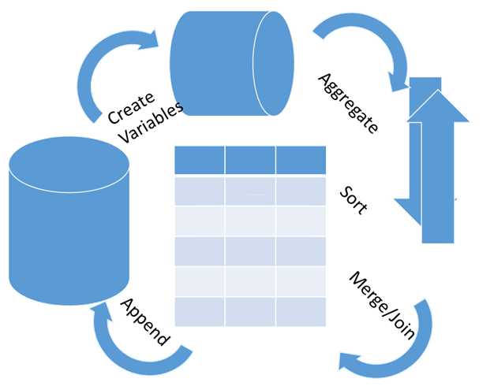

```{r setup, include=FALSE}
options(htmltools.dir.version = FALSE)
options(width=120)
knitr::opts_chunk$set(cache = TRUE, message=FALSE, warning=FALSE)
```

# What's covered in this lecture?



- Data Manipulation  

  - Data Wrangling
  
  - Feature Engineering 

- R:dplyr Package
 
- Pipes %>%
 

<br>
dplyr cheetsheet, Sparklyr, data.table 
---
class: center, middle

# 1. Data Manipulation  


---
# Data Exploration


- R for Data Science (O'Reilly 2017) by Hadley Wickham

- Free Online: http://r4ds.had.co.nz/  

- Major coverage: 

  - Data manipulation (R:dplyr)
  
  - Data visualization (R:ggplot2) 

- Data Exploration = Data manipulation + Data visualization.
---
# Data Wrangling

- Data wrangling (a term used in data science) is the process of transforming/mapping data from raw format into ready-to-analyze format. 

- Besides ggplot2() for data visualization, Hadley Wickham has created a series of R packages for data wrangling, including

  - tidyr for tidy data: observations in rows, variables in columns

  - tibble for better ways to create, print and subset data frames

  - dplyr for data manipulation -> today

- Refer to the ggplot2 book Chapter 9 about Tidy Data; and Chapter 10 about dplyr.


---
# Feature Engineering

- A term often used in machine learning

> Andrew Ng (Stanford): "Coming up with features is difficult, time-consuming, requires expert knowledge. _Applied machine learning_ is basically feature engineering."

- In statistics: variable creation and transformation 

- Dictionary learning with overcomplete features ...  

- Nowadays, deep learning algorithms aim at automatic feature learning instead of manual feature engineering ... 


---
class: center, middle

# 2. R:dplyr Package


---
# R::dplyr verbs

- filter() to select observations

- arrange() to order observations

- mutate() to add new variables

- group_by() to group variables for summarise

- R::base:merge() to combine two data.frames (or R::dplyr xxx_joins)


---
# Filter


```{r}
library(dplyr)
(tmp = filter(iris, Species == 'versicolor' & Sepal.Length > 6.6))
```

- Rowwise selection of samples/observations

- Similar to base:which or subsetting 

---
# Arrange

```{r}
arrange(tmp, Sepal.Length, Sepal.Width, desc(Petal.Length))
```

- Similar to base:sort and order functions 

---
# Mutate

```{r}
tmp = mutate(iris, Sepal.Size = Sepal.Length*Sepal.Width, 
             Petal.Size = Petal.Length*Petal.Width) 
head(tmp)
```

- New variable/feature creation 

- Base commands:  tmp$Sepal.Size = ...

---

```{r fig.align="center", fig.width=7, fig.asp=0.8}
library(ggplot2)
ggplot(tmp, aes(x=Sepal.Size, y=Petal.Size, colour=Species)) + 
  geom_point(size=2)
```


---
# Summarise

```{r}
summarise(group_by(tmp, Species), mean(Sepal.Size), mean(Petal.Size))
```

- Together with the group_by varaible 

---
# Merge

```{r}
(tmp1 = data.frame(Species=levels(iris$Species), x1 = c("A","B","C"), x2 = round(runif(3),3)))
head(merge(iris, tmp1, by = "Species"))
```

- I personally prefer base:merge() than dplyr:left/right/inner/full/etc_join functions 


---
class: center, middle

# 3. Pipes %>%


---
# Lastly, Pipes %>%

- The pipe %>% requires R package dplyr or magrittr

- Powerful trick for coding a sequence of operations

- Output of old operation as the first argument of new operation

- Especially useful in combined with ggplot2

- Let's demonstrate it with Iris dataset ... 


---

```{r fig.align="center", fig.width=6, fig.asp=0.9}
iris %>%
  mutate(Sepal.Size = Sepal.Length*Sepal.Width, 
         Petal.Size = Petal.Length*Petal.Width) %>%
  filter(Species != 'virginica') %>% 
  ggplot(aes(x=Sepal.Size, y=Petal.Size, colour=Species)) + 
  geom_point(size=2) + 
  geom_smooth(method = "lm") +
  labs(title = 'Iris Flower Size (setosa vs. versicolor)')
```

---
class: center, middle

# Thank you! 

Q&A or Email ajzhang@umich.edu。


