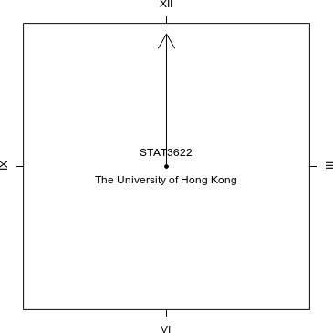

```{r setup, include=FALSE}
options(htmltools.dir.version = FALSE)
options(width=120)
knitr::opts_chunk$set(message=FALSE, warning=FALSE)
```

# What's covered in this lecture?


- Image Processing with R:magick 

- Animated Graphics

  - Examples of math animations

- Hans Rosling Bubbles 


---
class: center, middle

# 1. Image Processing with R:magick

---
# ImageMagick

<a href="https://www.imagemagick.org"></a>

- Support almost all image formats (PNG, JPG, GIF, TIFF, SVG, PDF, ...)

- Perhaps the most comprehensive open-source image processing library available today

- Overwhelming amount of functions: convert, resize, flip, mirror, rotate, distort, transform image, adjust color, draw text, draw shapes, special effects, ... 

- R:magick package based on Magick++ STL (Standard Template Library) algorithms 

- This lecture note is partly based on R:vignette [The magick package: Advanced Image-Processing in R](https://cran.r-project.org/web/packages/magick/vignettes/intro.html)


---
# R:magick Image IO, Convert and Display

```{r fig.align="center",  out.width = "200px", echo=TRUE}
library(magick)
frink <- image_read("https://jeroen.github.io/images/frink.png")
image_write(frink, path = "frink.gif", format = "gif")
  #in Rstudio: print(frink)
``` 

---
# R:magick with Pipes for Image Processing

```{r fig.align="center", fig.width=4, fig.asp = 0.8, echo=TRUE}
tmp = image_read("https://jeroen.github.io/images/frink.png") %>%
  image_rotate(270) %>% 
  image_resize("400") %>%
  image_background("lightblue", flatten = TRUE) %>%
  image_border("darkgreen", "20x20") %>%
  image_annotate("HKU STAT3622", color = "red", location = "+25+25", size = 20)
image_write(tmp, path = "frink1.png", format = "png")
   
``` 


---
class: center, middle

# 2. Animated Graphics

<br >

## Examples of Math Animations

---
# Animated Graphics 1: Running Clock

```{r echo=TRUE}
img <- image_graph(400, 400, res = 72)
for (i in seq(pi/2, -4/3*pi, length = 12)) {
  par(mar=c(3,3,3,3))
  plot(0, 0, pch = 20, ann = FALSE, axes = FALSE); box()
  text(0, 0.1, 'STAT3622'); text(0, -0.1, 'The University of Hong Kong')
  arrows(0, 0, cos(i), sin(i))  # Rotate every 30 degree
  axis(1, 0, "VI"); axis(2, 0, "IX"); axis(3, 0, "XII"); axis(4, 0, "III")
}
dummy = dev.off()
img %>% image_trim() %>%  image_animate(fps = 1) %>% image_write("Clock.gif")
``` 

```{r fig.align="center", out.width = "280px", echo=FALSE}
  
```


---
# Animated Graphics 2: Beating Heart

Mathematical "heart curves" at [Wolfram MathWorld](http://mathworld.wolfram.com/HeartCurve.html). Here is a new heart formula that can be made animating with varying parameter: 

$$
\frac{1}{2}|xy| - \frac{3a}{4}x^2 - \frac{4a}{7}y^2 - ay \geq 0, ~~ a\in[0.9, 1.3]
$$

```{r fig.align="center", echo=TRUE}
img <- image_graph(300, 300, res = 36)
n = 300
X = matrix(rep(seq(-1.4, 1.4, length=n), n), nrow=n, byrow=F) 
Y = matrix(rep(seq(0.1, -2.5, length=n), n), nrow=n, byrow=T) 
for (a in seq(0.9, 1.3, length = 2)) {
  Z = abs(X*Y)/2 - 3*a*X^2/4 - 4*a*Y^2/7 - a*Y
  Z[Z<=0] = NA
  par(mar = c(1,1,1,1))
  image(Z, col=2, ann = FALSE) 
} 
dummy = dev.off() 
img %>% image_trim() %>% image_animate(fps = 1) %>% image_write("Heart.gif")
``` 

---
# Animated Graphics 2: Beating Heart

```{r fig.align="center", out.width = "320px", echo=FALSE}
  
``` 

>"With four parameters I can fit an elephant, and with five I can make him wiggle his trunk." (John von Neumann) 


---
# Animated Graphics 3: Random Walk Simulation 

```{r fig.align="center",  echo=TRUE}
img <- image_graph(400, 300, res = 72)
# -------------------------
#  dX = mu*dt + sigma*dWt
#  dWt~ N(0,dt) 
# -------------------------
X0 = 0; mu = -0.1; sigma = 3; dt = 1; N = 30; m = 10
set.seed(201810)
X = matrix(NA, N+1, m)
for (k in 1:m) {
  dW = rnorm(N, 0, sqrt(dt)) 
  dX = mu*rep(dt, N) + sigma*dW
  X[,k] = cumsum(c(X0, dX))
  }
t = c(0,seq(1,N))
for (i in 1:N){ 
par(mar = c(2,2,2,2))
matplot(0:i*dt, X[1:(i+1),], 
        type='l', lty=1, col=rainbow(m), 
        xlim = c(0, dt*N),  ylim =  c(min(X), max(X)))
}
dummy = dev.off() 
img %>% image_trim() %>%  image_animate(fps = 2) %>% image_write("RandomWalk.gif")
```  


---
# Animated Graphics 3: Random Walk Simulation 

.pull-left[
Random wark simulation: 
```{r fig.align="center", out.width = "350px", echo=FALSE}
  
```
]

.pull-right[
Changing the simulation paparameters: 
```{r fig.align="center", out.width = "350px", echo=FALSE}
  
``` 

Can you tell what parameters were changed?


<!-- X0 = 0; mu = 2; sigma = 6; dt = 0.2; N = 150; m = 50 -->
<!-- img %>% image_trim() %>%  image_animate(fps = 10) %>% image_write("RandomWalk2.gif") -->
   
]


---
class: center, middle

# 3. Hans Rosling Bubbles 

<br >
## For memory of Hans Rosling

---
# Hans Rosling's TED Talk

```{r echo=FALSE, fig.align="center", out.width = "50%"}
 
```

- Hans Rosling at TED2006: [The best stats you've ever seen](https://www.ted.com/talks/hans_rosling_shows_the_best_stats_you_ve_ever_seen?language=en) [More than 12MM views]

- Watch also [YouTube video](https://www.youtube.com/watch?v=hVimVzgtD6w) [More than 2MM views] 

---
# Hans Rosling (1948 - 2017)


- A swidish professor of international health, a popular public speaker on DataViz for exploring dvelopment issues.

- Co-founded the [Gapminder](http://www.gapminder.org) and developed the DataViz software "Trendalyzer" (acquired by Google in 2007)


- Gapminder is best known for its bubble interactive charts; see also the [PublicData](https://www.google.com/publicdata/) by Google

- Hans Rosling was elected the TIME's Top 100 most influential people in 2012, and won the UN Population Award in 2017

- Died at age 68; read the [memorial by Bill Gates](https://www.gatesnotes.com/About-Bill-Gates/Remembering-Hans-Rosling)

- This lecture is also for memory of Hans Rosling，as he inspired us in many ways ... 

---
# Gapminder Dataset

- A small demonstration data sampled every five years

```{r}
library(gapminder)
summary(gapminder)
```

- See more complete data in [Gapminder Data](http://www.gapminder.org/data/)，[UN Data](http://data.un.org/) and [World Bank Open Data](https://data.worldbank.org/)


---
# Animated Graphics: Hans Rosling Bubbles 

R:gamminder data on life expectancy, GDP per capita, and population by country

```{r echo=TRUE}
library(ggplot2)
library(gapminder)  
Years = unique(gapminder$year)
Colmap = adjustcolor(c(3,2,4,5,6), alpha.f=0.6)
Idx = which(gapminder$country == "China")
Img <- image_graph(500, 500, res = 72)
for (k in 1:length(Years)){
  TmpX = gapminder[gapminder$year==Years[k], ]
  Size = 1+9*(TmpX$pop-min(gapminder$pop))/diff(range(gapminder$pop))
  plot(TmpX$gdpPercap, TmpX$lifeExp, log="x",
       xlim=range(gapminder$gdpPercap), xlab="GDP per capita",
       ylim=range(gapminder$lifeExp), ylab="Life Expectency",
       pch = 19, cex = Size, col=Colmap[TmpX$continent],
       main = paste("Year", Years[k]))
  text(gapminder$gdpPercap[Idx[k]], gapminder$lifeExp[Idx[k]], "China", cex=1.2)
  } 
dummy = dev.off() 
```


---
# Animated Graphics: Hans Rosling Bubbles 

```{r fig.align="center", out.width = "500px", echo=FALSE}
Img %>% image_trim() %>% image_animate(fps = 1) %>% image_write("RosBubble.gif")
   
``` 

<!-- --- -->
<!-- class: center, middle -->

<!-- # Annoucement: -->

<!-- ## Homework 1 to be released on Thursday (Oct 4) -->


---
class: center, middle

# Thank you! 

Q&A or Email ajzhang@hku.hk。


---
# HK Population Pyramid in Animation

```{r echo=TRUE}
library(magick)
library(ggplot2)
DataX = read.csv("HongKongPopulation2017.csv") 
tmp = levels(DataX$Age.group)
DataX$Age = factor(DataX$Age.group, tmp[c(2,11,3:10,12:18,1)])
DataX1 = rbind(data.frame(DataX[,c("Year","Age")], Gender="Male", Population=DataX[,3]),
               data.frame(DataX[,c("Year","Age")], Gender="Female", Population=DataX[,4]))
Years = unique(DataX1$Year)
img <- image_graph(500, 500, res = 72)
for (k in 1:length(Years)){
  TmpX = DataX1[DataX1$Year==Years[k], ]
  idx = TmpX$Gender=="Male"
  TmpX$Population[idx] = -TmpX$Population[idx]
  ggplot(TmpX, aes(x = Age, y = Population, fill=Gender)) + 
    geom_bar(stat="identity") +
    scale_y_continuous(labels = abs, limits = max(abs(DataX1$Population))*c(-1,1)) + 
    coord_flip() + theme_bw() + scale_fill_brewer(palette = "Set1") +
    ggtitle(paste("HK Population:", Years[k]))
}
dummy = dev.off() 
img %>% image_trim() %>% image_animate(fps = 1) %>% image_write("temp.gif")
```
 

---
# Hong Kong Population Pyramids In Animation

```{r fig.align="center", out.width = "400px", echo=FALSE}
knitr::include_graphics("temp.gif")   
``` 

- Data source: HK population by age group and sex from [Census and
Statistics Department](http://www.censtatd.gov.hk/hkstat/sub/sp150.jsp) 


