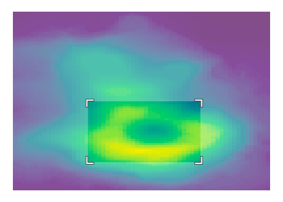
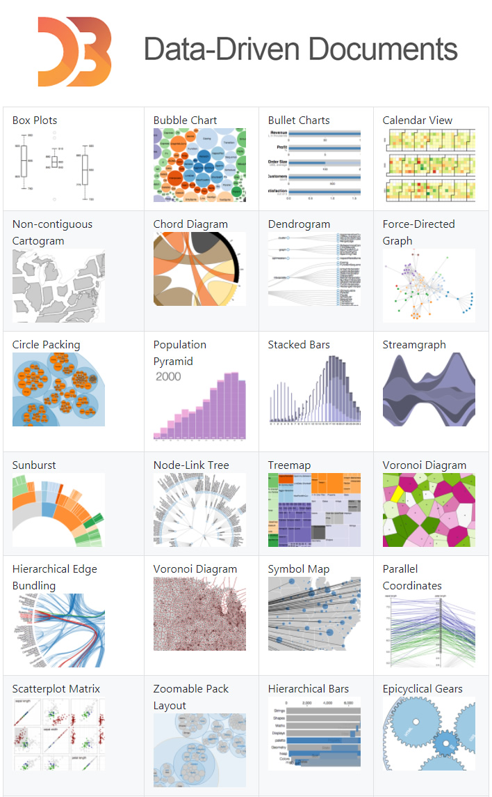

```{r setup, include=FALSE}
options(htmltools.dir.version = FALSE)
options(width=120)
knitr::opts_chunk$set(message=FALSE, warning=FALSE)
```

# DataViz Project (Call for Proposal)

1. Team size: 3~4 members 

1. Draft a proposal: 

  - find a topic or research question

  - describe the data source(s) and data background

  - plan for developing a DataViz app

  - plan to tell a good story behind data 

1. Submit via Moodle by March 28, 2020

---
# What's covered in this lecture?



- Interactive Data Visualization 
  
  - Introduction
  
  - D3.js Library

- iDataViz by Plotly for R

  - plot_ly
  
  - ggplotly

- Other Useful iDataViz Charts

- Call for DataViz Project Proposals

---
class: center, middle

# 1. Interactive Data Visualization

<br >

## An Introduction

---
# iDataViz - Introduction 

- iDataViz enables direct actions on a plot (e.g. mouse over, click, zoom, filter) to discover data information that may be otherwise hidden at the first sight.

- iDataViz rules (Ben Shneiderman, 1996): 

  - overview first, then 
  
  - explore the details on demand by zooming and filtering. 

- It is often delivered in web graphics/html pages that are simple to view (by web browsers) and simple to share (by Email or URL). 


See also: 

1. A book: [Interactive Data Visualization for the Web (Murray, 2017, O'Reilly, 2ed)](https://www.oreilly.com/library/view/interactive-data-visualization/9781491921296/)   
1. A blog post: [3 rules for Interactive data visualization](https://towardsdatascience.com/3-rules-for-interactive-data-visualizations-a-showcase-with-r-and-highcharts-e452f5c37f44)

---
# Why iDataViz?

- Convey more information than a static visualization

- Display more complex data: showing information only on demand, while hiding formation when not needed

- Promote interactive exploration: play with the chart with fun  


---
# Some iDataViz Examples 

1. [Lending Club Statistics](https://www.lendingclub.com/info/demand-and-credit-profile.action)

1. [Gapminder Tools about Global Development](https://www.gapminder.org/tools/)

1. [USA Federval Researve](https://www.federalreserve.gov/data/dataviz.htm)

1. [WHO Atlas](http://gamapserver.who.int/gho/interactive_charts/cholera/atlas.html)

1. [World Bank SDG Atlas](http://datatopics.worldbank.org/sdgatlas/)

1. [New York Times iDataViz Collections](http://getdolphins.com/blog/interactive-data-visualizations-new-york-times/)


---
# D3.js Library



- D3 is an open-source JavaScript library with powerful iDataViz functions. Used by hundreds of thousands of websites!

- Developed by [Mike Bostock](https://github.com/mbostock); Initial release: February 2011 

- Website: https://d3js.org/; Repository: https://github.com/d3

- A very long list of [D3 API functions](https://github.com/d3/d3/blob/master/API.md); There exisit [hundreds of tutorials](https://github.com/d3/d3/wiki/Tutorials) and  [thousands of examples](https://bl.ocks.org/)


- **Bad news:** too much to learn for beginners ...

- **Good news:** a high-level tool called Plotly, built on top of D3.js


---
# HTML Widgets for R


Check the [website of htmlwidgets for R](http://www.htmlwidgets.org/) for a list of useful iDataViz tools: 


- **plotly** a wonderful tool for iDataViz 

- **Leaflet** for map visualization

- **threejs** 3D scatterplots 

- **networkD3** for network visualization

- **dygraphs** for time series visualization

- **d3heatmap** for spatiotemporal heatmap and biclustering 


Some of these tools will be revisited when we discuss real data case studies.


---
class: center, middle

# 2. Plotly for R


---
# Plotly: Interactive Charts with D3

- Plotly is an interactive charting tool built on top of D3.js

- Rich API for R/ggplot2/Shiny, Python, MATLAB, Excel, ... 

- In this course, let us focus more on Plotly for R: 

  - See [Plotly R Library](https://plot.ly/r/)

  - See [Plotly ggplot2 Library](https://plot.ly/ggplot2/)

  - See [Plotly Shiny Gallery](https://plot.ly/r/shiny-gallery/) (in a later chapter)

- Online reference book: [Plotly for R](https://plotly-book.cpsievert.me/) by Carson Sievert 

  - [Carson Sievert](https://cpsievert.me/): [2017 Winner of John Chambers Award](https://talks.cpsievert.me/20170730/)

---
# Basic plot_ly Examples 

```{r fig.width=7, fig.asp=0.8}
library(plotly)
set.seed(202003)
plot_ly(x = ~rnorm(100), type = "histogram")
```
  
---

```{r fig.width=7, fig.asp=0.8}
plot_ly(alpha = 0.6) %>%
  add_histogram(x = ~rnorm(500), name="Dist1") %>%
  add_histogram(x = ~rnorm(500) + 1, name="Dist2") %>%
  layout(barmode = "overlay")
```

---
```{r fig.width=7, fig.asp=0.8}
plot_ly(y = ~rnorm(50), type = "box", name="Dist1") %>%
  add_trace(y = ~rnorm(50, 2, 0.5), name="Dist2") %>%
  add_trace(y = ~rnorm(50, 0, 2), name="Dist3")
```

---
```{r fig.width=7, fig.asp=0.8}
plot_ly(iris, x = ~Petal.Length, y = ~Petal.Width, 
        color = ~Species, size = ~Sepal.Length,
        type="scatter", mode = "markers", hoverinfo = 'text',
        text = ~paste("Species:", Species, 
                      '<br>Sepal.Length:', Sepal.Length, '<br>Sepal.Width:', Sepal.Width,
                      '<br>Petal.Length:', Petal.Length, '<br>Petal.Width:', Petal.Width)) %>%
  layout(legend = list(x = 100, y = 0.5))
```


---
# Plotting stock prices

```{r fig.width=12, fig.asp=0.7, echo=TRUE, eval=FALSE}
library(quantmod); library(plotly)
date0 = "2019-01-01"
dummy = getSymbols("0700.HK", src="yahoo", from = date0)
TmpX = as.data.frame(`0700.HK`)
TmpX$Date = row.names(TmpX)
TmpX %>% plot_ly(x = ~Date, type="candlestick", 
        open = ~`0700.HK.Open`, 
        close = ~`0700.HK.Close`, 
        high = ~`0700.HK.High`, 
        low = ~`0700.HK.Low`) %>% 
  layout(title = "0700.HK Tencent: Candlestick Chart")
```

---

```{r  fig.width=12, fig.asp=0.7, echo=FALSE, eval=TRUE}
library(quantmod); library(plotly)
date0 = "2019-01-01"
dummy = getSymbols("0700.HK", src="yahoo", from = date0)
TmpX = as.data.frame(`0700.HK`)
TmpX$Date = row.names(TmpX)
TmpX %>% plot_ly(x = ~Date, type="candlestick", 
        open = ~`0700.HK.Open`, 
        close = ~`0700.HK.Close`, 
        high = ~`0700.HK.High`, 
        low = ~`0700.HK.Low`) %>% 
  layout(title = "0700.HK Tencent: Candlestick Chart")
```

---
```{r fig.width=12, fig.asp=0.7, echo=T, eval=F}
date0 = "2019-01-01"
Symbol = c("0700.HK", "AAPL", "AMZN", "FB", "GOOGL", "MSFT", "JD", "BIDU", "BABA")
dummy = getSymbols(Symbol, src="yahoo", from = date0)
for (i in 1:length(Symbol)){
  eval(parse(text=paste("TmpX = as.data.frame(`",Symbol[i],"`)", sep="")))
  TmpX = data.frame(Date = row.names(TmpX), 
                    Price = TmpX[,6]/TmpX[1,6], 
                    Symbol = Symbol[i])
  if (i==1) DataX = TmpX 
  if (i>1) DataX = rbind(DataX, TmpX)
}
DataX$Date =  as.Date(DataX$Date)
plot_ly(DataX, x = ~Date, y = ~Price) %>%
  add_lines(color = ~ Symbol) %>%
  layout(title = "Relative Stock Prices in Comparison")
```

---
```{r fig.width=12, fig.asp=0.7, echo=F, eval=T}
date0 = "2019-01-01"
Symbol = c("0700.HK", "AAPL", "AMZN", "FB", "GOOGL", "MSFT", "JD", "BIDU", "BABA")
dummy = getSymbols(Symbol, src="yahoo", from = date0)
for (i in 1:length(Symbol)){
  eval(parse(text=paste("TmpX = as.data.frame(`",Symbol[i],"`)", sep="")))
  TmpX = data.frame(Date = row.names(TmpX), 
                    Price = TmpX[,6]/TmpX[1,6], 
                    Symbol = Symbol[i])
  if (i==1) DataX = TmpX 
  if (i>1) DataX = rbind(DataX, TmpX)
}
DataX$Date =  as.Date(DataX$Date)
plot_ly(DataX, x = ~Date, y = ~Price) %>%
  add_lines(color = ~ Symbol) %>%
  layout(title = "Relative Stock Prices in Comparison")
```


---
# ggplotly examples

```{r  fig.width=7, fig.asp=0.8}
library(ggplot2); library(plotly)
p = qplot(data=iris, Petal.Length, Petal.Width, colour=Species)
ggplotly(p)  # Just add this simple command
```

---
```{r fig.width=7, fig.asp=0.8}
p1 = ggplot(iris, aes(x=Sepal.Length, y=Petal.Length)) +
  geom_point(aes(color=Species)) + 
  geom_smooth(aes(color=Species)) + 
  theme_bw()  
ggplotly(p1)
```

---
```{r fig.width=7, fig.asp=0.8}
p2 = p1 + facet_wrap(~Species)
ggplotly(p2)
```


---
#  Key frame animation

```{r fig.width=7, fig.asp=0.7}
data(gapminder, package = "gapminder")
gg <- ggplot(gapminder, aes(gdpPercap, lifeExp, color = continent)) +
  geom_point(aes(size = pop, frame = year)) + scale_x_log10()
ggplotly(gg)
```


---
class: center, middle

# 3. Other useful iDataViz Charts


---
# d3Heatmap


```{r fig.width=7, fig.asp=0.8}
library(d3heatmap)
d3heatmap(mtcars, scale = "column", colors = "Spectral")
```

---
# threejs

* To plot 3D and let users change the perspectives of views 

```{r fig.width=7, fig.asp=0.7}
library(threejs)
z <- seq(-10, 10, 0.1)
x <- cos(z)
y <- sin(z)
scatterplot3js(x, y, z, color=rainbow(length(z)))
```


---
# leaflet

```{r fig.width=8, fig.asp=0.7}
library(leaflet)
leaflet() %>%
  addTiles() %>%  # Add map tiles (Default: OpenStreetMap)
  addMarkers(lng=114.137426, lat=22.282793, popup="The University of Hong Kong")
```

---
class: center, middle

# Thank you! 

Q&A or Email ajzhang@hku.hk。


