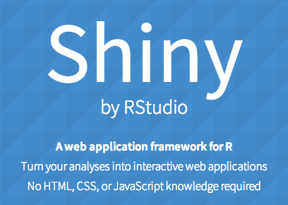
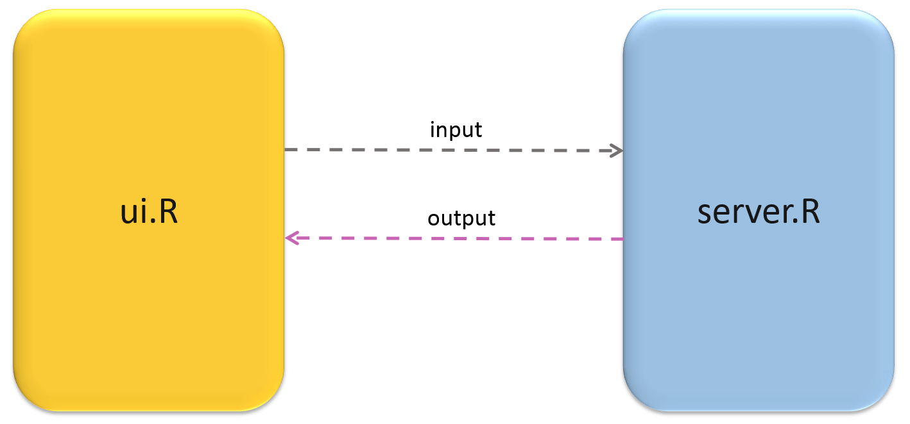
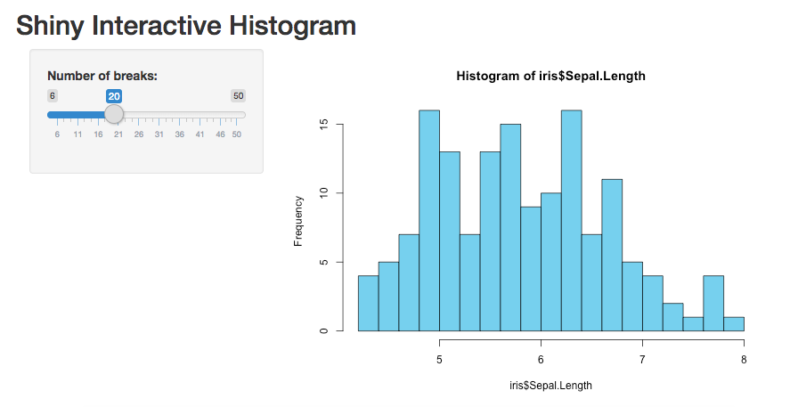

```{r setup, include=FALSE}
options(htmltools.dir.version = FALSE)
options(width=120)
knitr::opts_chunk$set(message=FALSE, warning=FALSE)
```

# What's covered in this lecture?



- Introduction to Shiny 
  
  - Shiny App Structure
  
  - R Markdown with Shiny
  
  - UI Widgets

  - Shiny Dashboard

- Shiny App Examples in RStuido/Rmarkdown

---
class: center, middle

# 1. Introduction to Shiny 


---
# Introduction to Shiny 

- Shiny is an R package, for easy building interactive web apps straight from R.

- Linked views of interactive data visualization (compare with plotly)

- It may enable R Markdown (dynamic documents) to be interactive

- It provides tools for building dashboards …

- Click [here](https://shiny.rstudio.com/images/shiny-cheatsheet.pdf) to download the Shiny cheat sheet. 

- Click https://shiny.rstudio.com/tutorial/ for wonderful tutorials


---
# Basic Structure: app.R

```{r echo=TRUE, eval=FALSE}
library(shiny)
ui <- ...
server <- ...
shinyApp(ui = ui, server = server)
```

```{r, out.width = "500px", fig.align='center', echo=FALSE}

```

- **ui module** (in the front end): control widgets (HTML elements)

- **server module** (in the back end): DataViz logic (i.e. R codes)

---
# R Markdown with Shiny

- In Rmd, add "runtime: shiny" in the header

- R chunk with `shinyApp(ui=..., server=...)`

```{r, echo = T, eval=FALSE}
shinyApp(
  # Define UI elements in the front end
  ui = fluidPage(
    titlePanel("Whatever App Title"),
    sidebarPanel(sliderInput("nbreaks", "Number of breaks:",
                             min = 6, max = 50, value = 20)),
    mainPanel(plotOutput("thisPlot"))
    ),
  # Define server logic in the back end
  server = function(input, output) {
    output$thisPlot <- renderPlot({
      hist(iris$Sepal.Length, n=input$nbreaks)
      })
  }, 
  options = list(height = 500)
)
```

- "Run Document" to generate the report with live Shiny apps


---
# Shiny makes interactive graphics! 

- Run the previous code in ["app.R"]() or in R markdown to have the following output:


```{r, out.width = "600px", fig.align='center', echo=FALSE}

```

- Unfortunately, so far the Rmd:xaringan (format for this presentation) does not support Shiny yet. 


---
# UI Widgets

- Web/HTML elements (See the collections below). Shiny has a built-in family of functions to create these widgets. See RStudio-Shiny's [Lesson 3](https://shiny.rstudio.com/tutorial/written-tutorial/lesson3/).

- Each widget is associated with an ID/pointer (invisible) and a label (visible).

```{r, out.width = "800px", fig.align='center', echo=FALSE}
knitr::include_graphics("ShinyWidgets.png")
```


---
# Built in Examples

In R console, run the following launch Shiny built-in examples 

```{r echo=TRUE, eval=FALSE}
library(shiny)
runExample("01_hello")
runExample("02_text")
runExample("03_reactivity")
runExample("04_mpg")
runExample("05_sliders")
runExample("06_tabsets")
runExample("07_widgets")
runExample("08_html")
runExample("09_upload")
runExample("10_download")
runExample("11_timer")
```

---
# Shiny Dashboard

- **R:shinydashboard** with URL: http://rstudio.github.io/shinydashboard/index.html


```{r, out.width = "500px", fig.align='center', echo=FALSE}
knitr::include_graphics("ShinyDashboard.png")
```

- Get started from here: http://rstudio.github.io/shinydashboard/get_started.html

---
class: center, middle

# 2. Shiny App Examples

<br>

## Switch to RStudio and RMarkdown


---
class: center, middle

# Thank you! 

Q&A or Email ajzhang@hku.hk。


