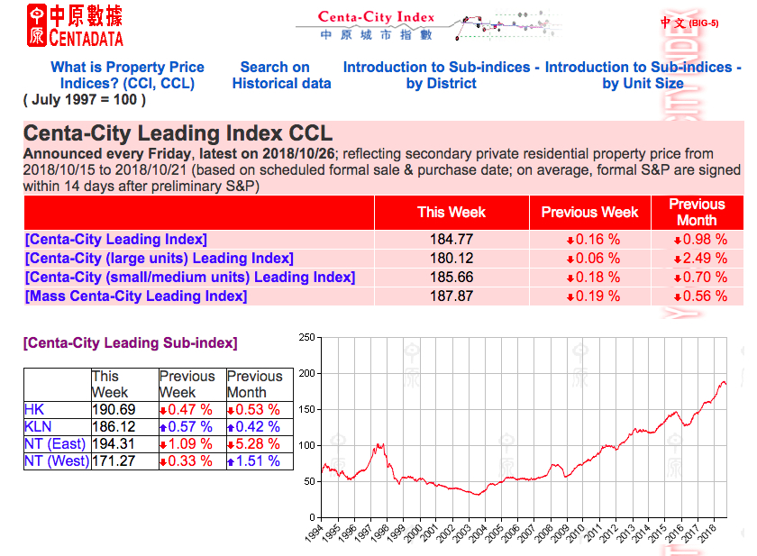
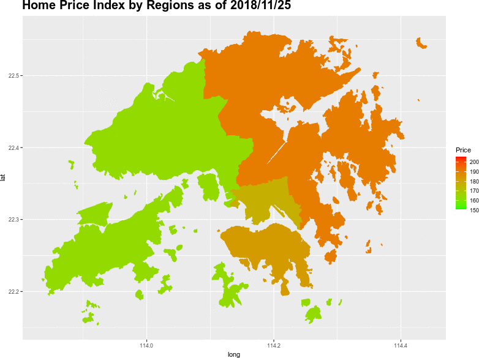

```{r setup, include=FALSE}
options(htmltools.dir.version = FALSE)
options(width=90)
knitr::opts_chunk$set(cache = TRUE, message=FALSE, warning=FALSE)
```

# What's covered in this lecture?

<!--img style="float: right; width: 400px; padding:0 50px 0 0;" src="HKHousing.jpg"-->

```{r fig.align="center", out.width = "500px", echo=FALSE}
knitr::include_graphics("HKHousing.jpg")  
``` 


- HK Centa-City Home Price Index

- Dynamic Map Visualization

- Spatiotemporal Data Visualization
 

 
---
class: center, middle

# 1. HK Centa-City Home Price Index

---
# Hong Kong Centa-City Index

- Purpose of study: to demonstrate geographical/spatiotemporal data visualization.

- Data source: [Centadata](http://www1.centadata.com/cci/cci_e.htm) by HK Centaline Agency Limited. 


```{r fig.align="center", out.width = "600px", echo=FALSE}
  
``` 


---
# Centa-City Leading Sub-index by Regions

- HK (Hong Kong Island): CW, EA, SO, WC

- KL (Kowloon): SS, KC, KU, WT, YT

- NTE (New Territories East): ST, TP, SK, NO

- NTW (New Territories West): TW, KI, TM, YL, IS

```{r fig.width=12, fig.asp=0.8, echo=T, eval=F}
library(plotly)
library(shiny)
library(xts)
DataX = read.csv("HKHomeCCLI.csv")
TsX = xts(DataX[,-1], order.by=as.Date(DataX[,1], "%Y/%m/%d"))
library(dygraphs)
div(dygraph(TsX, main = "HK Home Price: Centa-City Leading Index by Regions") %>%
      dyRangeSelector(dateWindow = c("1994-01-01", "2018-12-31")) %>%
      dyOptions(colors = c("red", "green", "blue", "cyan")), align="center")
```


```{r fig.align="center", fig.width=10, fig.asp=0.7, eval=F, echo=F}
div(DataX %>% plot_ly(x = ~Date, y = ~HK, name="HK Island", type = "scatter", mode="lines") %>% 
  add_trace(y = ~KL, name="Kowloon", type = "scatter") %>% 
  add_trace(y = ~NTE, name="New Territoryies (East)", type = "scatter") %>% 
  add_trace(y = ~NTW, name="New Territoryies (West)", type = "scatter") %>% 
  layout(title = "HK Centa-City Leading Index by Regions"), align = "center")
```  


---
# Interactive Time Series Visualization
```{r fig.width=12, fig.asp=0.8, echo=F, eval=T}
library(plotly)
library(htmltools)
library(xts)
DataX = read.csv("HKHomeCCLI.csv")
TsX = xts(DataX[,-1], order.by=as.Date(DataX[,1], "%Y/%m/%d"))
library(dygraphs)
div(dygraph(TsX, main = "HK Home Price: Centa-City Leading Index by Regions") %>%
      dyRangeSelector(dateWindow = c("1994-01-01", "2018-12-31")) %>%
      dyOptions(colors = c("red", "green", "blue", "cyan")), align="center")
```

---
# Map Visualization with Region Defintion

```{r fig.width=12, fig.asp=0.8, echo=T, eval=T}
library(ggplot2); library(sp)
hkmapraw = readRDS("HKG_adm1.rds") 
meta = data.frame(id=hkmapraw$ID_1, Code=hkmapraw$HASC_1)
meta$Region = "NTW"
meta$Region[meta$Code %in% c("HK.ST", "HK.TP", "HK.SK", "HK.NO")] = "NTE"
meta$Region[meta$Code %in% c("HK.CW", "HK.EA", "HK.SO", "HK.WC")] = "HK"
meta$Region[meta$Code %in% c("HK.SS", "HK.KC", "HK.KU", "HK.WT", "HK.YT")] = "KL"
meta$Region=as.factor(meta$Region)
hkmap = merge(fortify(hkmapraw), meta, by="id") 
summary(hkmap)
```

---
# Map Visualization with Region Defintion

```{r fig.align="center", fig.width=7, fig.asp=0.8, echo = T, eval=T}
ggplot(hkmap, aes(long, lat, group=group, fill=Region)) + geom_polygon()
```

---
# Dynamic Map Visualization 

```{r fig.align="center", fig.width=7, fig.asp=0.8, echo = T, eval=F}
library(magick)
img <- image_graph(800, 600, res = 72)
iidx = c(seq(dim(DataX)[1], 1, -104), 1)
for (i in iidx){
  cat(i, "\n")
  TmpX = data.frame(Region=names(DataX)[-1], Price=as.numeric(DataX[i,-1]))
  MapDataX = merge(hkmap, TmpX, by="Region")
  p = ggplot(MapDataX, aes(long, lat, group=group, fill=Price)) + geom_polygon() +
    scale_fill_gradient(limits=c(30,200), low = "green", high = "red") +
  ggtitle(paste("Home Price Index by Regions as of", DataX$Date[i])) + 
  theme(plot.title = element_text(size = 20, face = "bold"))
  print(p)
}
dummy = dev.off() 
img %>% image_trim() %>%  image_animate(fps = 1, loop=1) %>% image_write("HomePriceMap.gif")
```

---
# Dynamic Map Visualization 

```{r fig.align="center", out.width = "660px", echo=FALSE}
  
``` 

---
# Home Prices for Selected Estates 

- In each of 4 regions, we pick 3 estates and download their historical weekly prices. URL: http://202.72.14.52/p2/cci/SearchHistory.aspx


```{r}
DataX = read.csv("HKHomePrice.csv")
DataX$Date = as.POSIXlt(DataX$Date, format="%d/%m/%Y")  # handle date/time in R
DataX = DataX[order(DataX$Date), ]
DataX = DataX[DataX$Date >= "2014-01-01", ]
head(DataX)
```

---
# Temporal and Spatial Variations

- Temporal

```{r fig.align="center", fig.width=10, fig.asp=0.6, eval=F, echo=T}
n = dim(DataX)[1]
m = dim(DataX)[2]-1
matplot(DataX[, -1], type="l", lty=1, col=rainbow(m),  xaxt="n", ylab="", xlim=c(1,n+10))
axis(1,at=1:n,labels=format(DataX$Date, "%Y%m"))
text(n, tail(DataX[,-1], 1), names(DataX)[-1], p=4, cex=0.6)
title(main="Home Prices for Selected Estates in Hong Kong", 
      xlab="Time", ylab="Unit Price (net area)")
```

- Spatial

```{r fig.align="center", fig.width=9, fig.asp=0.8, eval=F, echo=T}
boxplot(DataX[,-1], col=rainbow(m),  
        main="Median Prices and Variations Among and Within Estates")
```


---
```{r fig.align="center", fig.width=13, fig.asp=0.6, eval=T, echo=F}
n = dim(DataX)[1]
m = dim(DataX)[2]-1
matplot(DataX[, -1], type="l", lty=1, col=rainbow(m),  xaxt="n", ylab="", xlim=c(1,n+10))
axis(1,at=1:n,labels=format(DataX$Date, "%Y%m"))
text(n, tail(DataX[,-1], 1), names(DataX)[-1], p=4, cex=0.6)
title(main="Home Prices for Selected Estates in Hong Kong", xlab="Time", ylab="Unit Price (net area)")
```

---
```{r fig.align="center", fig.width=13, fig.asp=0.6, eval=T, echo=F}
boxplot(DataX[,-1], col=rainbow(m),  
        main="Median Prices and Variations Among and Within Estates")
```


---
# Space-Time Heatmap

<!-- - aka. Hovmöller diagram -->

```{r fig.align="center", fig.width=8, fig.asp=0.8, eval=T, echo=T}
tmp = as.matrix(DataX[,-1])
par(mar=c(1,1,1,1)); image(tmp, col=terrain.colors(m), axes=FALSE) 
text(0, seq(0,1,length.out=m), names(DataX)[-1], p=4, cex=1)
```

```{r fig.align="center", fig.width=9, fig.asp=0.7, eval=F, echo=F}
library(d3heatmap)
tmp2 = DataX[,-1]; row.names(tmp2) = DataX[,1]
d3heatmap(t(tmp2),  dendrogram = "row", k_row = 5, colors = "YlOrRd", 
          yaxis_font_size=14, xaxis_font_size=2)
```

---
class: center, middle

# Thank you! 

Q&A or Email ajzhang@hku.hk。


