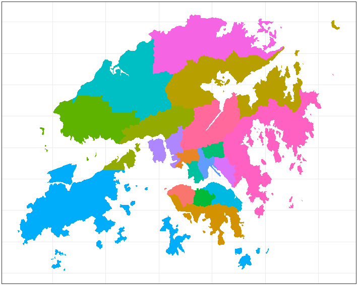

```{r setup, include=FALSE}
options(htmltools.dir.version = FALSE)
options(width=90)
knitr::opts_chunk$set(cache = TRUE, message=FALSE, warning=FALSE)
```


  
  
# What's covered in this lecture?



- Display Maps in R

  - World/Countries
  
  - Hong Kong SAR
  
  - R:leaflet Package
  
- Data Visualization on Maps

- Case Study: HK Home Prices
 

 
---
class: center, middle

# 1. Display Maps in R

---
# Map Visualization

- Geographical/spatial data visualization

- Spatial data structure

- Static and interactive maps

- R packages: maps, sp, ggplot2, plotly, leaflet …
 

---
# World Map in R

```{r fig.align="center", fig.width=8, fig.asp = 0.8, echo=TRUE}
library(maps)
map('world', fill=TRUE, border='black',  col='gray',   bg='white')
``` 

---
# World Map by R:ggplot2

```{r fig.align="center", fig.width=8, fig.asp = 0.7, echo=TRUE}
library(ggplot2)
worldmap = map_data('world')
ggplot(worldmap, aes(long, lat, group=group)) + geom_polygon(fill='yellow', colour="green") +
  theme_bw()
``` 

---
# Map Data Structure
```{r fig.align="center", fig.width=6, echo = T}
str(worldmap)
head(worldmap)
```

---
# Country Maps: US

```{r fig.align="center", fig.width=7, fig.asp=0.7, echo = T}
thismap = map_data("state") 
ggplot(thismap, aes(long, lat, group=group, fill=region)) +  geom_polygon(show.legend = F) 
```

---
# Country Maps: China
```{r fig.align="center", fig.width=7, fig.asp=0.7, echo = T}
library(mapdata) # map data for more countries
thismap = map("china", plot=F)
ggplot(thismap, aes(long, lat, group=group)) +  geom_path() + ylim(15,55)
```

- A tutorial in Chinese: https://cosx.org/2009/07/drawing-china-map-using-r/
 

---
# Hong Kong Map Data
-  Download map database (.rds) source: [http://gadm.org/country](http://gadm.org/country)

```{r fig.align="center", fig.width=6, fig.asp=0.7, echo = T}
library(sp)
hkmap = readRDS("HKG_adm1.rds") 
class(hkmap)
```

- ggplot2::fortify converts "sp" object to data.frame


```{r fig.align="center", fig.width=6, fig.asp=0.7, echo = T}
library(ggplot2)
hkmapdf = fortify(hkmap) 
head(hkmapdf,3)
```


---
# Hong Kong SAR Map

```{r fig.align="center", fig.width=8, fig.asp=0.8, echo = T}
ggplot(hkmapdf, aes(long, lat, group=group, fill=id)) + geom_polygon(show.legend = F) 
```

---
# Extra data from Wikipedia

- HK population by districts: https://en.wikipedia.org/wiki/Districts_of_Hong_Kong 
- Copy and paste datatable to Excel plus some manual editing

```{r fig.align="center", fig.width=9, fig.asp=0.8, echo = T}
wikidata = read.csv("HK18Districts.csv"); 
library(knitr); kable(wikidata, format="html")
```


---
# Map Wikidata with HKmap$HASC_1
```{r fig.align="center", fig.width=9, fig.asp=0.8, echo = T}
hkmapmeta = data.frame(mapid=hkmap$ID_1, Code=hkmap$HASC_1)
hkmapmeta$Code = gsub('HK.', '', as.character(hkmapmeta$Code))
hkmapmeta = merge(wikidata, hkmapmeta, by="Code", sort=FALSE)
kable(hkmapmeta, format="html") 
``` 

---
# Merge HKMap DataFrame with Wikidata
```{r fig.align="center", fig.width=8, fig.asp=0.8, echo = T}
hkmapdf = merge(hkmapdf,hkmapmeta, by.x="id", by.y="mapid")
head(hkmapdf)
```

---
# Hong Kong Map: 3 Regions
```{r fig.align="center", fig.width=7, fig.asp=0.8, echo = T}
ggplot(hkmapdf, aes(long, lat, group=group, fill=Region)) + geom_polygon()
```

---
# Hong Kong Map: 18 Districts
```{r fig.align="center", fig.width=8, fig.asp=0.75, echo = T}
ggplot(hkmapdf, aes(long, lat, group=group, fill=Code)) + geom_polygon() +
  guides(fill=guide_legend(title='18 Districts', ncol = 2)) 
```

<!-- --- -->
<!-- # Interactive Maps by R:leaflet -->
<!-- ```{r fig.align="center", fig.asp=0.5, fig.width=10} -->
<!-- library(leaflet) -->
<!-- leaflet() %>% addTiles() %>%  # Add map tiles (Default: OpenStreetMap) -->
<!--   addMarkers(lng=114.137426, lat=22.282793, popup="The University of Hong Kong") -->
<!-- ``` -->

<!-- --- -->
<!-- # Adding Map Markers: EV Charging Stations  -->

<!-- ```{r fig.align="center", fig.width=10, fig.asp=0.8, echo = T} -->
<!-- mapdata = read.csv("hkecharge.csv")   -->
<!-- kable(t(mapdata[1:3,]), format="html") # the first record -->
<!-- ```   -->

<!-- - Download the data from [https://DATA.GOV.HK/](https://data.gov.hk/en-data/dataset/hkelectric-tnd_cs_ci-hkelectric-ev-location) -->

<!-- --- -->
<!-- # Adding Map Markers: EV Charging Stations  -->
<!-- ```{r fig.asp=0.5, fig.width=10} -->
<!-- leaflet(data = mapdata) %>% addTiles() %>%  -->
<!--   addMarkers(~Longitude, ~Latitude, popup = ~as.character(Address)) %>% -->
<!--   setView(lng = 114.183413 , lat = 22.248648, zoom=12) -->
<!-- ``` -->


---
class: center, middle

# 2. Data Visualization on Maps


---
# HK Population by Districts

```{r fig.align="center", fig.width=8, fig.asp=0.7, echo = T}
ggplot(hkmapdf, aes(long, lat, group=group, fill=Population)) + geom_polygon() + 
  ggtitle("Population by Districts") 
```

---
# HK Population Density by Districts
```{r fig.align="center", fig.width=8, fig.asp=0.7, echo = T}
ggplot(hkmapdf, aes(long, lat, group=group, fill=Density)) + geom_polygon() +
  ggtitle("Population Density by Districts")  
``` 

---
# HK Population Density by Districts

- Customized color bar by manually setting `scale_fill_gradient`

```{r fig.align="center", fig.width=8, fig.asp=0.7, echo = T}
ggplot(hkmapdf, aes(long, lat, group=group, fill=Density)) + geom_polygon() +
  scale_fill_gradient(limits=range(hkmapdf$Density), low="white", high="red") +
  ggtitle("Population Density by Districts")  
```  


---
class: center, middle

# 3. Case Study: HK Home Prices

```{r fig.align="center", out.width = "500px", echo=FALSE}
knitr::include_graphics("HKHousing.jpg")  
``` 

<br />
Purpose of study: to demonstrate geographical/spatiotemporal data visualization.

Click the [HTML](Lecture8_HomePrice.html) file generated by R markdown. 

---
class: center, middle

# Thank you! 

Q&A or Email ajzhang@umich.edu。


